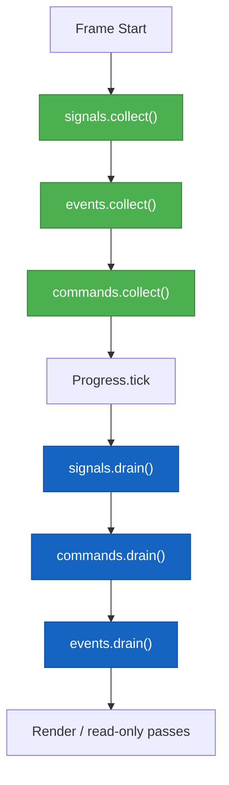

# AGENTS — Eon ECS Guidance for Automation & AI Assistants

This document gives autonomous agents (and fast‑moving humans) a concise, accurate picture of the **Eon ECS** codebase and its intended usage patterns. Use it to design helpers, write scripts, or reason about future changes without reading the entire source tree.

---

## 1. What Is Eon ECS?

Eon ECS is a **minimal, deterministic, backend‑agnostic entity–component–system runtime**. It delivers:

- A **small World API** that owns entities, component storage, and resource stores.
- **Message buses** (`Signals`, `Events`, `Commands`) that enforce intent → effect → reaction ordering.
- A **Pipeline** for ordering system phases.
- A **Progress controller** (variable / fixed / hybrid time modes) that advances pipelines, plus a **Loop** that orchestrates collect → tick → drain → render.

The core stays pure and assumption‑free: no rendering, input, or physics. Higher layers (the engine) inject those concerns.

### Core Principles (from README.md)

| Principle     | Meaning                                                                              |
|---------------|--------------------------------------------------------------------------------------|
| Minimalism    | The core ships only primitives—no default gameplay components or phases.            |
| Extensibility | All key modules are functors / open polymorphic variants to support custom stacks.  |
| Purity        | Systems mutate world state only via command handlers, keeping update logic pure.    |
| Determinism   | Fixed or hybrid progress modes guarantee stable simulations when needed.            |

---

## 2. Default Stack: “Plug & Play” Modules

While everything is functorised, everyday usage normally sticks to the default stack exported from `eon_ecs/eon_ecs.ml`:

| Role        | Default Module                 | Notes                                                                 |
|-------------|--------------------------------|------------------------------------------------------------------------|
| World       | `Eon_ecs.World`                | Main user API. Owns entities, components, resources, and services.     |
| Systems     | `Eon_ecs.System.Default`       | Reactive systems with built‑in buses and command/event handlers.       |
| Pipeline    | `Eon_ecs.Pipeline.Default`     | Phase graph over polymorphic variant keys.                             |
| Progress    | `Eon_ecs.Progress.Default`     | Variable, Fixed(step), Hybrid modes wired for `System.kind` variants.  |
| Loop        | `Eon_ecs.Loop.Default`         | Clock + progress + renderer + default buses for a ready-to-run loop.   |
| Buses       | `System.Signal_bus`, `Event_bus`, `Command_bus` | Single- vs double-buffer semantics baked in.                           |

> Tip: For custom kind tags (`\`AI`, `\`Replay`, …) you can use `System.Make_with_kinds` and `Progress.Make_with_kind`, but the defaults cover the canonical `[ \`Fixed | \`Variable ]` workflow.

### Public API Entry Point (`eon_ecs/eon_ecs.ml` + `eon_ecs/eon_ecs.mli`)

Treat these files as the canonical package surface and composition root.

- `eon_ecs/eon_ecs.mli` is the API contract:
  - it defines what downstream users should depend on.
  - it should prefer stable names and documented module intent.
- `eon_ecs/eon_ecs.ml` is the wiring layer:
  - re-exports core modules (`World`, `Query`, `Entity_id`, etc.).
  - defines default bus aliases (`Signals`, `Events`, `Commands`).
  - composes the default stack (`System.Default` -> `Pipeline.Default` -> `Progress.Default` -> `Loop.Default`).
  - still exposes functors (`System.Make`, `Pipeline.Make`, `Progress.Make`, `Loop.Make`) for custom stacks.

Design intent:

- New users should be able to stay inside `Eon_ecs.*` without importing internal implementation modules.
- Advanced users can customize via exposed functors and module types without forking internals.
- Internal modules not re-exported here should be treated as private/unstable integration detail.

When adding/changing core modules:

1. Decide whether the module belongs in the public surface (`eon_ecs.mli`) or should stay internal.
2. If public, add both type-level docs in `.mli` and wiring in `.ml`.
3. Keep default aliases coherent so the canonical usage pattern in this document remains valid.

---

## 3. Canonical Usage Pattern

The following outline shows the full lifecycle of a simple game loop using only default modules. The code is intentionally verbose so that generated assistants stay accurate.

```ocaml
module World    = Eon_ecs.World
module System   = Eon_ecs.System.Default
module Pipeline = Eon_ecs.Pipeline.Default
module Progress = Eon_ecs.Progress.Default
module Query    = Eon_ecs.Query
module Signals  = Eon_ecs.Signals
module Events   = Eon_ecs.Events
module Commands = Eon_ecs.Commands
module Loop     = Eon_ecs.Loop.Default

(* 1. Build buses and register them as services. *)
let world =
  let world = World.create () in
  let signals  = Signals.create ()
  and events   = Events.create ()
  and commands = Commands.create () in
  World.add_service world `Signals  signals;
  World.add_service world `Events   events;
  World.add_service world `Commands commands;
  ignore (World.register_component world ~name:"Position" ~id:0);
  ignore (World.register_component world ~name:"Velocity" ~id:1);
  let _player =
    let entity = World.create_entity world in
    World.add_component world entity ~name:"Position" (0.0, 0.0);
    World.add_component world entity ~name:"Velocity" (1.0, 0.0);
    entity
  in
  world

let signals  = World.get_service world `Signals  |> Option.get
let events   = World.get_service world `Events   |> Option.get
let commands = World.get_service world `Commands |> Option.get

(* 3. Define systems — use make_reactive and attach handlers. *)
let movement_system =
  System.make_reactive
    ~update:(fun world dt ->
      Query.iter2 world "Position" "Velocity"
        (fun entity (x, y) (vx, vy) ->
          let speed = (vx *. dt, vy *. dt) in
          Commands.emit commands (`Move_player (entity, speed)) ))
    ~on_command:(fun world -> function
        | `Move_player (entity, (dx, dy)) ->
            begin
              match World.get_component world entity ~name:"Position" with
              | Some (x, y) ->
                  World.set_component world entity ~name:"Position" (x +. dx, y +. dy)
              | None -> ()
            end
        | _ -> ())
    ~kind:`Fixed
    ()
  |> System.attach_handlers
       ~signals ~events ~commands
       world

(* 4. Assemble pipeline & register systems once. *)
let pipeline =
  Pipeline.create ()
  |> Pipeline.add_phase `Gameplay
  |> Pipeline.add_system `Gameplay movement_system

let () = Pipeline.register_all pipeline world

(* 5. Pick a time mode and run the loop. *)
let progress = Progress.create ~mode:(Progress.Hybrid 0.016) pipeline

module Loop = Eon_ecs.Loop.Default

let should_continue _world () = true

let final_world =
  Loop.run
    ~progress
    ~world
    ~should_continue

```

**Logging renderer example** – swap in a renderer that inspects the world after every frame (using `Logs` to keep dependencies light):

```ocaml
module Logging_renderer (Log : sig val info : (('a, Format.formatter, unit, unit) format4) end) = struct
  type world = World.t
  type result = unit

  let render world ~dt =
    let positions =
      let acc = ref [] in
      Query.iter1 world "Position" (fun entity (x, y) ->
          acc := (Entity_id.index entity, x, y) :: !acc);
      List.rev !acc
    in
    Log.info
      "[frame dt=%.3f] positions: %a"
      dt
      (Fmt.list (fun fmt (id, x, y) -> Format.fprintf fmt "(%d -> %.2f, %.2f)" id x y))
      positions
end

module Loop_with_logging = Eon_ecs.Loop.Make
    (Clock.Mtime)
    (Progress.Default)
    (Logging_renderer(struct let info = Logs.info end))
    (struct
       type world = World.t
       let require world key =
         match World.get_service world key with
         | Some bus -> bus
         | None ->
             let id = Hashtbl.hash key land Stdlib.max_int in
             failwith (Printf.sprintf "Missing service (hash:%d)" id)
       let collect world =
         let signals  = require world `Signals in
         let events   = require world `Events in
         let commands = require world `Commands in
         Signals.collect signals;
         Events.collect events;
         Commands.collect commands
       let drain world =
         let signals  = require world `Signals in
         let events   = require world `Events in
         let commands = require world `Commands in
         Signals.drain signals;
         Commands.drain commands;
         Events.drain events
     end)

let () =
  Logs.set_reporter (Logs_fmt.reporter ());
  Logs.set_level (Some Logs.Info);
  ignore (Loop_with_logging.run ~progress ~world ~should_continue)

```

**Render graph skeleton** – build a neutral graph from the world, ready for a renderer backend:

```ocaml
module Render_graph = struct
  type node = {
    entity : Entity_id.t;
    position : float * float;
    sprite : string option;
  }

  type t = node list

  let build world : t =
    let nodes = ref [] in
    Query.iter1 world "Position" (fun entity (x, y) ->
        let sprite = World.get_data world (`Sprite (Entity_id.index entity)) in
        nodes := { entity; position = (x, y); sprite } :: !nodes);
    List.rev !nodes

  let pp fmt graph =
    Fmt.(list ~sep:(any "\n")
           (fun fmt n ->
             match n.sprite with
             | Some s -> Format.fprintf fmt "entity %d -> (%.1f, %.1f) sprite=%s"
                           (Entity_id.index n.entity) (fst n.position) (snd n.position) s
             | None -> Format.fprintf fmt "entity %d -> (%.1f, %.1f)"
                           (Entity_id.index n.entity) (fst n.position) (snd n.position)))
      fmt
      graph
end

module Render_graph_logger = struct
  type world = World.t
  type result = unit

  let render world ~dt =
    let graph = Render_graph.build world in
    Logs.info (fun m -> m "[%.3f] render graph:@.%a" dt Render_graph.pp graph)
end

module Loop_with_render_graph = Eon_ecs.Loop.Make
    (Clock.Mtime)
    (Progress.Default)
    (Render_graph_logger)
    (struct
       type world = World.t
       let require world key =
         match World.get_service world key with
         | Some bus -> bus
         | None ->
             let id = Hashtbl.hash key land Stdlib.max_int in
             failwith (Printf.sprintf "Missing service (hash:%d)" id)
       let collect world =
         let signals  = require world `Signals in
         let events   = require world `Events in
         let commands = require world `Commands in
         Signals.collect signals;
         Events.collect events;
         Commands.collect commands
       let drain world =
         let signals  = require world `Signals in
         let events   = require world `Events in
         let commands = require world `Commands in
         Signals.drain signals;
         Commands.drain commands;
         Events.drain events
     end)

let () =
  Logs.set_reporter (Logs_fmt.reporter ());
  Logs.set_level (Some Logs.Info);
  ignore (Loop_with_render_graph.run ~progress ~world ~should_continue)
```

### Message Bus Order (default loop wiring)
1. `collect` **Signals → Events → Commands** at the start of the frame.
2. Call `Progress.tick`.
3. End of frame: `drain` **Signals → Commands → Events** exactly once (drains on the single buses also apply any same-frame emissions).
4. Render (or any read-only pass) **after** the drains so the world is fully up to date.

This sequencing keeps commands same-frame, events next-frame, and signals transient.



---

## 4. Notable APIs & Conventions

| Area       | API Pointers                                                                                                          |
|------------|------------------------------------------------------------------------------------------------------------------------|
| Components | Register components up front; use `World.add_component` for first attach, `World.set_component` for updates.           |
| Messaging  | Systems should never manually drain/collect; the `Loop` orchestrates buses.                                            |
| Systems    | `System.make_reactive` is declarative; you can provide any subset of the record fields (`register`, `update`, etc.).   |
| Kinds      | Default kinds are `[ \`Fixed | \`Variable ]`. For custom tags, create a `Kinds` module and use `System.Make_with_kinds`.|
| Progress   | `Progress.Make_with_kind` + `Custom (Mode { ... })` let you plug fully bespoke time modes.                             |
| Resources  | World services and data are keyed by open variants hashed to ints in `Resource_store`.                                |

---

## 5. Loop Module (implemented)

The `Loop` module mirrors the “functor + default alias” style used by `System`, `Pipeline`, and `Progress` and is fully implemented. `Eon_ecs.Loop` also ships a `Progress_adapter`, `Noop_renderer`, and `Loop_default_buses` used by the default wiring.

```ocaml
module Loop = struct
  module type CLOCK = sig val now : unit -> float end

  module type RENDERER = sig
    type world
    type result
    val render : world -> dt:float -> result
  end

  module type BUSES = sig
    type world
    val collect : world -> unit
    val drain   : world -> unit
  end

  module Make
      (Clock    : CLOCK)
      (Progress : sig
         type 'phase t
         type world
         val tick : 'phase t -> world:world -> dt:float -> world
       end)
      (Renderer : RENDERER with type world = Progress.world)
      (Buses    : BUSES with type world = Progress.world) = struct
    val step :
      progress:'phase Progress.t ->
      world:Progress.world ->
      last_time:float ->
      now:float ->
      should_continue:(Progress.world -> Renderer.result -> bool) ->
      Progress.world * float * Renderer.result * bool

    val run :
      progress:'phase Progress.t ->
      world:Progress.world ->
      should_continue:(Progress.world -> Renderer.result -> bool) ->
      Progress.world
  end

  module Default = Make
      ( Clock.Mtime )
      (Progress_adapter)
      (Noop_renderer)
      (Loop_default_buses)
end
```

**Frame flow inside `run`**

1. `Buses.collect world` → Signals → Events → Commands.
2. `dt = Clock.now () -. last_time`; `world' = Progress.tick progress ~world ~dt`.
3. `Buses.drain world'` → Signals → Commands → Events.
4. `result = Renderer.render world' ~dt`.
5. Loop while `should_continue world' result` is true.

You can plug in a real renderer (build a render graph or call a backend), switch clocks for determinism, or swap the progress controller without touching the loop core. The default alias uses `Clock.Mtime`, the stock buses, and a no-op renderer, so it works out of the box.

---

## 6. Philosophy Reminders (for future contributors)

- **Commands mutate, Events describe, Signals announce.** Stick to the naming tense guidelines.
- Rendering should **pull** from the world after command handlers run; don’t treat events as a high-frequency render feed.
- Keep the core pure: anything side-effecty (I/O, audio, input polling) belongs in engine-level systems that emit commands/signals.
- Determinism comes from respecting the bus order and using fixed/hybrid progress modes for simulation-critical logic.

---

## 7. Build, Test, Bench (Justfile)

Use `just` to run the supported workflows defined in the project `Justfile`.

```sh
just tasks
just build
just run-tests
just bench-sparse-set
just bench-entity-manager
just bench-query
just bench-world
```

Task intent:

- `just tasks`: list available tasks.
- `just build`: compile the workspace (`dune build`).
- `just run-tests`: run the full test suite (`dune test`).
- `just bench-sparse-set`: run Sparse_set benchmarks (release profile).
- `just bench-entity-manager`: run Entity_manager benchmarks (release profile).
- `just bench-query`: run Query iteration benchmarks (release profile).
- `just bench-world`: run World component benchmarks (release profile).

## 8. Testing Playbook

Test layout:

- Test directory: `eon_ecs/test/`
- Dune test stanza: `eon_ecs/test/dune`
- Test entrypoint and suite registry: `eon_ecs/test/test_main.ml`
- Current unit framework: `Alcotest`

Run commands:

```sh
just run-tests
opam exec -- dune test
opam exec -- dune exec eon_ecs/test/test_main.exe
```

Property testing conventions:

- Preferred library: `QCheck2` via `qcheck`, integrated with `qcheck-alcotest`.
- Naming: use `test_prop_<area>.ml` for property suites.
- Registration: add each new property suite to `test_main.ml`.
- Scope: keep generators small, shrinkable, and model-based.
- Debugging: run failing properties with a fixed seed and replay minimized counterexamples.

Suggested QCheck suite map (from TODO):

- `Sparse_set`: membership invariants.
- `Entity_manager`: generational safety.
- `World`: resource/component round-trips.
- `Double_bus`: `collect`/`drain` delivery guarantees.
- `Pipeline` + `Progress`: topo/order and tick-order guarantees.
- `Loop.step`: collect -> tick -> drain -> render sequencing.

## 9. Benchmark Setup & Comparison

Benchmark layout and wiring:

- Bench directory: `eon_ecs/bench/`
- Dune wiring: `eon_ecs/bench/dune`
- Shared helpers: `eon_ecs/bench/benchmark_helpers.ml`
- Current executables:
  - `bench_sparse_set.ml`
  - `bench_entity_manager.ml`
  - `bench_query.ml`
  - `bench_world.ml`

Current benchmark implementation style (keep this consistent):

- Use `Bechamel` with `Staged` benchmarks (`Test.make ... (stage (fun () -> ...))`).
- Precompute fixture data outside the hot loop to avoid measuring setup allocations.
- Group related cases with `Test.make_grouped` and explicit workload sizes in test names.
- Use a fixed config for comparability:
  - `Benchmark.cfg ~limit:50 ~quota:(Time.second 1.0) ()`
- Prefer deterministic/randomized workloads with explicit seeds when randomness is used.
- For query/world shape variants, use helper distributions from `Benchmark_helpers`:
  - `default_distribution`, `distribution_all`, `distribution_every`,
    `distribution_alternating`, `distribution_random`, `distribution_gradient`.
- For multi-metric benches, include time + allocation instances:
  - `monotonic_clock`, `minor_allocated`, `major_allocated`.
- For mixed `World.get_component` lookup benchmarks, include multiple topologies:
  - `mixed` (alternating hit/miss),
  - `clustered` (hit block then miss block),
  - `random50` (deterministic seeded random hit/miss).
  This captures branch/locality sensitivity better than a single mixed pattern.

Helper utilities available in `benchmark_helpers.ml`:

- `register_components`: consistent component registration.
- `populate_world`: reusable world fixture generator.
- `analyze_single_instance`: OLS analysis against run count.
- `pp_results`: uniform textual reporting (`time/run` or `alloc/run`).
- `bench_with_gc`: convenience runner for time + allocation metrics.

How to compare benchmark runs:

1. Run benchmarks in release profile and capture outputs.
2. Repeat each benchmark at least 3 times on a quiet machine.
3. Compare like-for-like test names only (same entity/component counts and distribution labels).
4. Prioritize `time/run` deltas first; then check `minor_allocated` and `major_allocated`.
5. Treat small changes as noise unless they are stable across repeated runs.

What to look for:

- Regressions:
  - sustained `time/run` increase across repeats.
  - increased `major_allocated` (usually higher risk than minor allocation growth).
  - widened gap in high-cardinality cases (`10_000+`, `50_000+`) vs small cases.
- Improvements:
  - stable `time/run` reduction without compensating large allocation growth.
  - flatter scaling between small and large workloads.

Practical run protocol:

```sh
just bench-sparse-set | tee /tmp/bench_sparse_set_run1.txt
just bench-sparse-set | tee /tmp/bench_sparse_set_run2.txt
just bench-sparse-set | tee /tmp/bench_sparse_set_run3.txt
```

Repeat for `bench-entity-manager`, `bench-query`, and `bench-world`, then compare matching test lines.

## 10. Contribution Checklist

- After code changes, run `just run-tests`.
- For ordering or determinism changes, add/adjust property tests before merge.
- For performance-sensitive changes, run the relevant bench task(s).
- Keep this file and TODO status aligned with the actual test/bench coverage.

## 11. Architecture Invariants (Do Not Break)

- Bus order: collect `Signals -> Events -> Commands`; drain `Signals -> Commands -> Events`.
- Command semantics: same-frame effects through handlers.
- Event semantics: queued reactions, delivered on the double-buffer schedule.
- Signal semantics: transient notifications.
- Render/read-only passes happen after drains, not before.
- Determinism-sensitive logic must run under fixed or hybrid progress modes.

## 12. API Stability Policy

Public API boundary:

- Anything exported from `eon_ecs/eon_ecs.mli` is public API.
- Anything not exported there is internal and may change without notice.

Breaking-change policy:

- Treat these as breaking:
  - Removing or renaming public modules, values, or types.
  - Changing public type signatures in incompatible ways.
  - Changing core semantics documented as invariants (bus order, frame timing behavior).
- For intended breaking changes, prefer a deprecation window when practical:
  - Keep old symbol with deprecation notice.
  - Introduce replacement API in the same release.
  - Remove in the next planned breaking release.

Compatibility guidance:

- Prefer additive changes (`new module/value`) over in-place mutation of existing signatures.
- Preserve default stack wiring semantics unless explicitly version-bumped.
- Update this document and README examples whenever public API shape changes.

## 13. Release Checklist

Before tagging a release:

1. Build and test:
   - `just build`
   - `just run-tests`
2. Performance sanity:
   - run relevant benchmarks for touched subsystems.
   - if performance-sensitive code changed, run all bench tasks.
3. API and docs sync:
   - ensure `eon_ecs/eon_ecs.mli` matches intended public surface.
   - update `README.md` and `AGENTS.md` for behavior/API changes.
4. TODO/status hygiene:
   - mark completed benchmark/property-test TODO items.
   - add new TODOs only with clear scope and target module.
5. Packaging sanity:
   - verify dune/opam metadata remains valid for test/build deps.

## 14. Adding a New Core Module (Playbook)

Use this sequence when introducing a new core ECS module.

1. Implement module internals:
   - add `<module>.ml` and `<module>.mli` under `eon_ecs/`.
   - keep implementation-specific helpers internal to that module unless broadly reusable.
2. Decide public exposure:
   - if public, re-export from `eon_ecs/eon_ecs.mli` with short intent docs.
   - wire module alias/composition in `eon_ecs/eon_ecs.ml`.
3. Connect to default stack if applicable:
   - if module affects systems/pipeline/progress/loop defaults, update the corresponding `Default` wiring.
4. Add tests:
   - unit tests in `eon_ecs/test/test_<module>.ml`.
   - property tests in `eon_ecs/test/test_prop_<module>.ml` when invariants are stateful/order-sensitive.
   - register suites in `eon_ecs/test/test_main.ml`.
5. Add benchmarks when perf-relevant:
   - create `eon_ecs/bench/bench_<module>.ml`.
   - reuse `benchmark_helpers.ml` patterns and metrics.
   - add `just` task if it is a benchmark intended for regular use.
6. Update docs:
   - add usage notes to `AGENTS.md`.
   - update README examples if user-facing API changed.
7. Final validation:
   - run `just build`, `just run-tests`, and relevant benches.

## 15. Commit Message Convention

Use commit subject lines that match existing history style.

Primary format:

- `[eon :: <area>] <summary>`

Examples from current history:

- `[eon :: docs] align design docs`
- `[eon :: bench] add query benchmark matrix`
- `[eon :: core] harden sparse-set growth & add benches`
- `[eon :: tooling] add Justfile for tests and benchmarks`
- `[eon :: ecs] factor benchmark helpers`

Area tokens currently used:

- `docs`, `bench`, `core`, `tooling`, `ecs`

Fallback format (already present in history):

- `[eon] <summary>`

Style rules:

- Keep subject concise and action-oriented (usually imperative mood).
- Prefer sentence case with minimal punctuation.
- Mention the primary subsystem touched; avoid generic summaries.
- If one commit spans multiple areas, pick the dominant area or use fallback `[eon]`.

## TODO

- Benchmark with Bechamel: ✅ `Sparse_set`, `Entity_manager` (create/destroy, churn, world attach-detach), `Query.iter{1,2,3,4}`, and `World.set_component/get_component`; ⏳ still pending `Loop.step`.
- Add QCheck suites: `Sparse_set` membership invariants, `Entity_manager` generational safety, `World` resource/component round-trips, `Double_bus.collect/drain` delivery guarantees, `Pipeline.topo_sort` and `Progress.tick` ordering, plus `Loop.step` sequencing.
