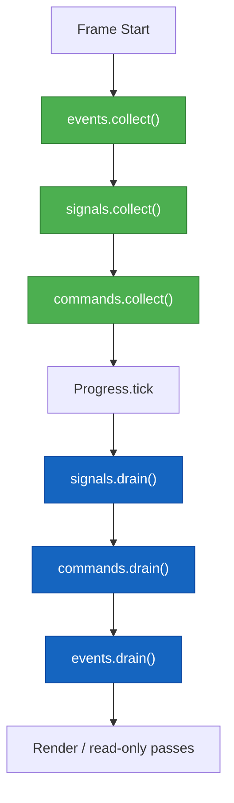

# AGENTS — Eon ECS Guidance for Automation & AI Assistants

This document gives autonomous agents (and fast‑moving humans) a concise, accurate picture of the **Eon ECS** codebase and its intended usage patterns. Use it to design helpers, write scripts, or reason about future changes without reading the entire source tree.

---

## 1. What Is Eon ECS?

Eon ECS is a **minimal, deterministic, backend‑agnostic entity–component–system runtime**. It delivers:

- A **small World API** that owns entities, component storage, and resource stores.
- **Message buses** (`Signals`, `Events`, `Commands`) that enforce intent → effect → reaction ordering.
- A **Pipeline** for ordering system phases.
- A **Progress controller** (variable / fixed / hybrid time modes) that orchestrates frames.

The core stays pure and assumption‑free: no rendering, input, or physics. Higher layers (the engine) inject those concerns.

### Core Principles (from README.md)

| Principle     | Meaning                                                                              |
|---------------|--------------------------------------------------------------------------------------|
| Minimalism    | The core ships only primitives—no default gameplay components or phases.            |
| Extensibility | All key modules are functors / open polymorphic variants to support custom stacks.  |
| Purity        | Systems mutate world state only via command handlers, keeping update logic pure.    |
| Determinism   | Fixed or hybrid progress modes guarantee stable simulations when needed.            |

---

## 2. Default Stack: “Plug & Play” Modules

While everything is functorised, everyday usage normally sticks to the default stack exported from `eon_ecs/eon_ecs.ml`:

| Role        | Default Module                 | Notes                                                                 |
|-------------|--------------------------------|------------------------------------------------------------------------|
| World       | `Eon_ecs.World`                | Main user API. Owns entities, components, resources, and services.     |
| Systems     | `Eon_ecs.System.Default`       | Reactive systems with built‑in buses and command/event handlers.       |
| Pipeline    | `Eon_ecs.Pipeline.Default`     | Phase graph over polymorphic variant keys.                             |
| Progress    | `Eon_ecs.Progress.Default`     | Variable, Fixed(step), Hybrid modes wired for `System.kind` variants.  |
| Buses       | `System.Signal_bus`, `Event_bus`, `Command_bus` | Single- vs double-buffer semantics baked in.                           |

> Tip: For custom kind tags (`\`AI`, `\`Replay`, …) you can use `System.Make_with_kinds` and `Progress.Make_with_kind`, but the defaults cover the canonical `[ \`Fixed | \`Variable ]` workflow.

---

## 3. Canonical Usage Pattern

The following outline shows the full lifecycle of a simple game loop using only default modules. The code is intentionally verbose so that generated assistants stay accurate.

```ocaml
module World    = Eon_ecs.World
module System   = Eon_ecs.System.Default
module Pipeline = Eon_ecs.Pipeline.Default
module Progress = Eon_ecs.Progress.Default
module Query    = Eon_ecs.Query
module Signals  = Eon_ecs.Signals
module Events   = Eon_ecs.Events
module Commands = Eon_ecs.Commands
module Loop     = Eon_ecs.Loop.Default

(* 1. Build buses and register them as services. *)
let world =
  let world = World.create () in
  let signals  = Signals.create ()
  and events   = Events.create ()
  and commands = Commands.create () in
  World.add_service world "Signals"  signals;
  World.add_service world "Events"   events;
  World.add_service world "Commands" commands;
  ignore (World.register_component world ~name:"Position" ~id:0);
  ignore (World.register_component world ~name:"Velocity" ~id:1);
  let _player =
    let entity = World.create_entity world in
    World.add_component world entity ~name:"Position" (0.0, 0.0);
    World.add_component world entity ~name:"Velocity" (1.0, 0.0);
    entity
  in
  world

let signals  = World.get_service world "Signals"  |> Option.get
let events   = World.get_service world "Events"   |> Option.get
let commands = World.get_service world "Commands" |> Option.get

(* 3. Define systems — use make_reactive and attach handlers. *)
let movement_system =
  System.make_reactive
    ~update:(fun world dt ->
      Query.iter2 world "Position" "Velocity"
        (fun entity (x, y) (vx, vy) ->
          let speed = (vx *. dt, vy *. dt) in
          Commands.emit commands (`Move_player (entity, speed)) ))
    ~on_command:(fun world -> function
        | `Move_player (entity, (dx, dy)) ->
            begin
              match World.get_component world entity ~name:"Position" with
              | Some (x, y) ->
                  World.set_component world entity ~name:"Position" (x +. dx, y +. dy)
              | None -> ()
            end
        | _ -> ())
    ~kind:`Fixed
    ()
  |> System.attach_handlers
       ~signals ~events ~commands
       world

(* 4. Assemble pipeline & register systems once. *)
let pipeline =
  Pipeline.create ()
  |> Pipeline.add_phase `Gameplay
  |> Pipeline.add_system `Gameplay movement_system

let () = Pipeline.register_all pipeline world

(* 5. Pick a time mode and run the loop. *)
let progress = Progress.create ~mode:(Progress.Hybrid 0.016) pipeline

module Loop = Eon_ecs.Loop.Default

let should_continue _world () = true

let final_world =
  Loop.run
    ~progress
    ~world
    ~should_continue
```

### Message Bus Order (per README.md)
1. `collect` **Signals → Events → Commands** at the start of the frame.
2. Call `Progress.tick`.
3. End of frame: `drain` **Signals → Commands → Events** exactly once (drains on the single buses also apply any same-frame emissions).
4. Render (or any read-only pass) **after** the drains so the world is fully up to date.

This sequencing keeps commands same-frame, events next-frame, and signals transient.



---

## 4. Notable APIs & Conventions

| Area       | API Pointers                                                                                                          |
|------------|------------------------------------------------------------------------------------------------------------------------|
| Components | Use `World.add_component` when attaching for the first time, `World.set_component` for updates.                        |
| Messaging  | Systems should never manually drain/collect; only `Progress` orchestrates buses.                                      |
| Systems    | `System.make_reactive` is declarative; you can provide any subset of the record fields (`register`, `update`, etc.).   |
| Kinds      | Default kinds are `[ \`Fixed | \`Variable ]`. For custom tags, create a `Kinds` module and use `System.Make_with_kinds`.|
| Progress   | `Progress.Make_with_kind` + `Custom (Mode { ... })` let you plug fully bespoke time modes.                             |
| Resources  | World services (buses, singletons) ride on `Resource_store` with typed IDs; data entries are keyed by strings.         |

---

## 5. Loop Module Design (proposed)

Plan for a lightweight `Loop` module that mirrors the “functor + default alias” style used by `System`, `Pipeline`, and `Progress`:

```ocaml
module Loop = struct
  module type CLOCK = sig val now : unit -> float end

  module type RENDERER = sig
    type world
    type result
    val render : world -> dt:float -> result
  end

  module type BUSES = sig
    type world
    val collect : world -> unit
    val drain   : world -> unit
  end

  module Make
      (Clock    : CLOCK)
      (Progress : sig
         type 'phase t
         type world
         val tick : 'phase t -> world:world -> dt:float -> world
       end)
      (Renderer : RENDERER with type world = Progress.world)
      (Buses    : BUSES with type world = Progress.world) = struct
    val run :
      progress:'phase Progress.t ->
      world:Progress.world ->
      should_continue:(Progress.world -> Renderer.result -> bool) ->
      Progress.world
  end

  module Default = Make
      ( Clock.Mtime )
      (Progress.Default)
      (struct type world = World.t
              type result = unit
              let render _ ~dt:_ = () end)
      (struct
         type world = World.t
         let collect world =
           let signals  = World.get_service world "Signals"  |> Option.get in
           let events   = World.get_service world "Events"   |> Option.get in
           let commands = World.get_service world "Commands" |> Option.get in
           Signals.collect signals;
           Events.collect events;
           Commands.collect commands
         let drain world =
           let signals  = World.get_service world "Signals"  |> Option.get in
           let events   = World.get_service world "Events"   |> Option.get in
           let commands = World.get_service world "Commands" |> Option.get in
           Signals.drain signals;
           Commands.drain commands;
           Events.drain events
       end)
end
```

**Frame flow inside `run`**

1. `Buses.collect world` → Signals → Events → Commands.
2. `dt = Clock.now () -. last_time`; `world' = Progress.tick progress ~world ~dt`.
3. `Buses.drain world'` → Signals → Commands → Events.
4. `result = Renderer.render world' ~dt`.
5. Loop while `should_continue world' result` is true.

You can plug in a real renderer (build a render graph or call a backend), switch clocks for determinism, or swap the progress controller without touching the loop core. The default alias uses `Unix.gettimeofday`, the stock buses, and a no-op renderer, so it works out of the box.

---

## 5. Philosophy Reminders (for future contributors)

- **Commands mutate, Events describe, Signals announce.** Stick to the naming tense guidelines.
- Rendering should **pull** from the world after command handlers run; don’t treat events as a high-frequency render feed.
- Keep the core pure: anything side-effecty (I/O, audio, input polling) belongs in engine-level systems that emit commands/signals.
- Determinism comes from respecting the bus order and using fixed/hybrid progress modes for simulation-critical logic.

---

## 6. Suggested Future Additions

When updating this file, consider documenting:

1. **Extended Kind Examples** – show how `System.Make_with_kinds` and `Progress.Make_with_kind` enable tags like `\`AI` or `\`Replay`.
2. **Custom Progress Modes** – a short example of wrapping a bespoke accumulator in `Progress.Custom`.
3. **World Service Catalog** – describe typical services (input, audio, render graph) and their expected keys in the resource store.
4. **Testing Playbook** – outline how to unit test systems by attaching them to dummy buses and worlds.

Feel free to extend AGENTS.md as the engine grows—the goal is to keep automation-friendly guidance close to the code.
