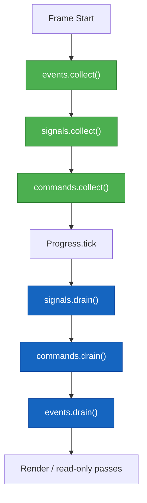
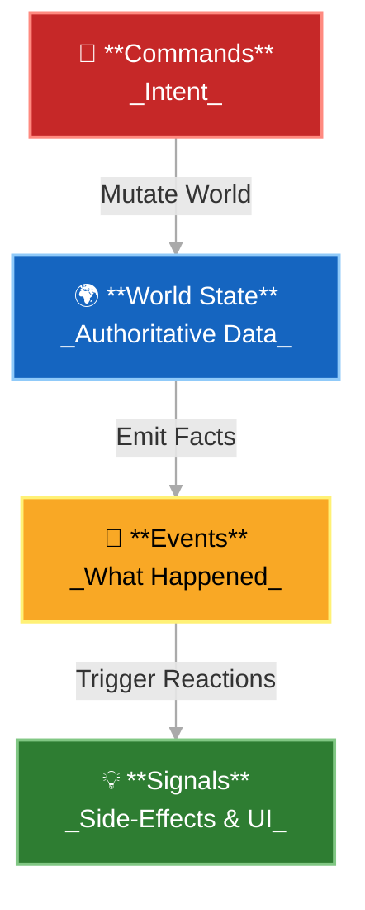

[](https://github.com/imunitic/eon/actions/workflows/ci.yml)

# 🧩 Eon ECS Development Canvas (Project‑Wide Master)

📘 **This is the project‑wide master design canvas for the Eon ECS project.**  
All ECS‑related updates, architectural decisions, and implementation notes are stored and refined here.

---

## 1️⃣ Core TODOs

- Implement `Resource_store` (v2: service-plane + data-plane) ✅ *(done)*
- Implement `Signals`, `Events`, and `Commands` (effect-based buses with `on`, `emit`, `drain`, `collect`) ✅ *(done)*
- Implement `System.t` — record of function references: ✅ *(done)*
  - `register : world -> unit`
  - `update : world -> float -> unit`
  - `on_signal : world -> Signal.t -> unit`
  - `on_event : world -> Event.t -> unit`
  - `on_command : world -> Command.t -> unit`
- Implement `Pipeline` with ordered Phases (use polymorphic variants `[> ]` for extensibility) ✅ *(done)*
- Implement `Ecs_progress` with Variable, Fixed, and Hybrid modes ✅ *(done)*
- Implement Query interface with `query2`, `query3`, `query4` ✅ *(done)*
- Implement optional Drawable / RenderGraph integration for rendering
- Implement multiple Pipelines per World (active/inactive switching for pause/UI separation)
- Add QCheck property-based tests for critical components
- Add Benchmarking Suite using Bechamel ✅ *(initial sparse-set & entity-manager coverage)*

## 2️⃣ ECS Core Philosophy 💎

The **Eon ECS Core** is designed to be minimal, pure, and backend-agnostic. It provides only the primitives needed for entity/component/resource management and execution scheduling. It does not assume or ship any default components, systems, or phases.

## 3️⃣ Key Principles ⚖️

- **Minimalism:** No assumptions about rendering, input, or physics.
- **Extensibility:** Expose hooks and registries for engine-level systems.
- **Purity:** No side-effects or parallelism inside ECS Core; handled in the Engine.
- **Determinism:** Fixed-update logic through `Ecs_progress` ensures stable simulations.

## 4️⃣ Architecture Overview 🏗️

### 4.1 🌍 World

- Acts as the main API surface for end users.
- Owns and manages `Entity_manager`, `Component_registry`, `Resource_store`, and `Pipeline`.
- Provides `add_component`, `get_component`, `remove_component`, and resource helpers.

### 4.2 🗃️ Resource_store (v2)

- Two planes: services (`Hashtbl`) and data (`Sparse_set`).
- Efficient for both persistent services and transient data.
- Uses open polymorphic variant keys hashed via `Hashtbl.hash` for lightweight lookups.

### 4.3 🧠 Systems

- Defined as records with function pointers.
- Registered into the world via `World.add_system`.
- Internally categorized into Phases (Input, Logic, Command, Render).
- Support filtering and dependency ordering via the Pipeline.

### 4.4 🧮 Pipeline

- Defines ordered Phases with optional dependency rules.
- May later support functorized multi-threaded execution.
- Multiple pipelines per world supported (e.g., Game vs UI).

### 4.5 🕹️ Ecs_progress

- Orchestrates the main loop.
- Controls frame pacing and timing strategies (Variable, Fixed, Hybrid).
- Integrates with buses (Signals, Events, Commands).

#### 🕰️ Frame Lifecycle (Canonical Order)

The `Ecs_progress` orchestrator processes the three buses in a strict and deterministic order each frame:

```ocaml
(* --- Frame start --- *)
events.collect ();
signals.collect ();
commands.collect ();

(* --- Run all systems --- *)
Pipeline.run world dt;

(* --- Frame end --- *)
signals.drain ();
commands.drain ();
events.drain ();

(* --- Render / side effects --- *)
Render.draw world;
```



**Rationale:**
- **Events** are collected first (they represent what happened last frame).
- **Signals** and **Commands** are collected once at frame start; `drain` later applies any same-frame emissions.
- **Signals** and **Commands** are drained first to apply same-frame mutations before rendering.
- **Events** are drained last (swapping buffers for the next frame).
- Rendering or other read-only passes happen **after** all drains so the world reflects every mutation.

This ensures deterministic simulation order and predictable message flow.


### 4.6 💬 Messaging System

- Unified abstraction for Signals, Events, and Commands.
- Each implemented as a resource (bus) in the `Resource_store`.
- All systems are read-only on data; mutations occur via Commands.
- Systems **only emit or handle** messages; they never perform bus management.
- The `Ecs_progress` orchestrator exclusively handles the message lifecycle:
  - `collect` gathers pending messages.
  - `emit` queues new messages.
  - `drain` processes messages and automatically performs the internal buffer `swap` for double-buffered buses (e.g., Events and Commands).

#### 🧱 BUS Module Type

```ocaml
module type BUS = sig
  type 'msg t

  val create : unit -> 'msg t
  val on : 'msg t -> ('msg -> unit) -> unit
  val emit : 'msg t -> 'msg -> unit
  val collect : 'msg t -> unit
  val drain : 'msg t -> unit
end
```

#### ⚖️ Expected Message Volume Hierarchy

In a typical ARPG-style frame, the expected message volume follows this pattern:

| Bus | Expected Volume | Example | Role |
|------|----------------|----------|------|
| **Commands** | 🔥 Highest | `Move`, `Attack`, `Apply_damage` | Immediate simulation intent |
| **Events** | ⚙️ Moderate | `Entity_moved`, `Enemy_died`, `Item_picked` | Simulation facts (next frame) |
| **Signals** | 🌊 Lowest | `UI_opened`, `Button_pressed`, `Sound_played` | Transient UI or audio notifications |

**Summary:**  
- `Commands > Events > Signals` in both count and frequency.  
- `Commands` are produced by nearly every system each frame.  
- `Events` are emitted for significant state changes.  
- `Signals` are emitted only by UI or side-effect systems.

This volume hierarchy reflects the causal order of simulation data flow:

```
Commands  →  World Mutation  →  Events  →  Signals
(Intent)       (Effect)          (Result)   (Reaction)
```

#### 🧭 Message Flow and Causality

The causal flow of information and actions through the ECS simulation frame:



**Interpretation:**
- **Commands** → Intent: the verbs of simulation (requests for action).  
- **World** → Effect: the authoritative data layer where mutations occur.  
- **Events** → Result: facts produced by simulation changes.  
- **Signals** → Reaction: side-effects such as UI or audio notifications.

#### ⚙️ Single_bus — same-frame processing (Queue-based, production-grade)

```ocaml
module Single_bus : BUS = struct
  type 'msg t = {
    queue : 'msg Queue.t;
    subscribers : ('msg -> unit) list ref;
  }

  let create () = { queue = Queue.create (); subscribers = ref [] }

  let on bus cb = bus.subscribers := cb :: !(bus.subscribers)

  let emit bus msg = Queue.add msg bus.queue

  let collect bus =
    while not (Queue.is_empty bus.queue) do
      let msg = Queue.take bus.queue in
      List.iter (fun cb -> cb msg) !(bus.subscribers)
    done

  let drain = collect
end
```

#### 🔄 Double_bus — next-frame processing (Queue-based, production-grade)

```ocaml
module Double_bus : BUS = struct
  type 'msg t = {
    mutable current : 'msg Queue.t;
    mutable next : 'msg Queue.t;
    subscribers : ('msg -> unit) list ref;
  }

  let create () =
    { current = Queue.create (); next = Queue.create (); subscribers = ref [] }

  let on bus cb = bus.subscribers := cb :: !(bus.subscribers)

  let emit bus msg = Queue.add msg bus.next

  let collect bus =
    while not (Queue.is_empty bus.current) do
      let msg = Queue.take bus.current in
      List.iter (fun cb -> cb msg) !(bus.subscribers)
    done

  let drain bus =
    collect bus;
    let tmp = bus.current in
    bus.current <- bus.next;
    bus.next <- tmp;
    Queue.clear bus.next
end
```

#### 🧩 Signals, Events, and Commands Modules

```ocaml
module Signals = struct
  type t = Signal.t Single_bus.t
  let create = Single_bus.create
  let on = Single_bus.on
  let emit = Single_bus.emit
  let collect = Single_bus.collect
  let drain = Single_bus.drain
end

module Events = struct
  type t = Event.t Double_bus.t
  let create = Double_bus.create
  let on = Double_bus.on
  let emit = Double_bus.emit
  let collect = Double_bus.collect
  let drain = Double_bus.drain
end

module Commands = struct
  type t = Command.t Single_bus.t
  let create = Single_bus.create
  let on = Single_bus.on
  let emit = Single_bus.emit
  let collect = Single_bus.collect
  let drain = Single_bus.drain
end
```

#### 📘 Semantic Overview of Signals, Events, and Commands

| Type | Bus | Emission → Processing | Purpose | Example |
|------|-----|------------------------|----------|----------|
| **Signal** | `Single_bus` | Same frame | Notifications | `UI_opened`, `Player_hit` |
| **Event** | `Double_bus` | Next frame | Simulation facts — "what happened" | `Entity_moved`, `Item_picked` |
| **Command** | `Single_bus` (for now) | Same frame | Intent to mutate — "what should happen" | `Move`, `Apply_damage` |

**Rationale:**
- **Signals:** processed immediately within the same frame for transient or side-effectful notifications.
- **Events:** deferred one frame for deterministic simulation ordering and clear separation of cause/effect.
- **Commands:** processed within the same frame for responsiveness and simplicity; can later switch to `Double_bus` if deferred mutation or determinism is required.

This model ensures deterministic yet responsive frame-to-frame messaging, with each bus type having a clear semantic role.

#### 📘 Example: Movement System Message Flow

This example demonstrates how `Signals`, `Events`, and `Commands` interact within a single frame using the **movement system** as a reference.

**Components:**
```ocaml
type position = { mutable x : float; mutable y : float }
type velocity = { dx : float; dy : float }
```

**System Flow:**
1. **`update`** — read-only logic:
   - Queries entities with `Position` and `Velocity`.
   - Calculates intended movement.
   - Emits a `Move (entity, dx, dy)` **Command**.

2. **`on_command`** — mutation phase:
   - Receives `Move` commands in the same frame.
   - Applies changes to the entity’s `Position`.
   - Emits an `Entity_moved (entity, x, y)` **Event** for the next frame.

3. **`on_event`** — observation phase:
   - Runs next frame when the `Entity_moved` event is collected.
   - Used by systems like rendering, particles, or AI.

**Lifecycle Summary:**
| Frame Stage | Description | Buses Used |
|--------------|--------------|-------------|
| Collect | Process messages from last frame | Events (Double_bus) |
| Update | Emit new `Move` commands | Commands (Single_bus) |
| Command Handling | Apply movement immediately | Commands (Single_bus) |
| Event Emission | Schedule `Entity_moved` for next frame | Events (Double_bus) |
| Drain | Finalize & swap | Events + Commands |

**Result:**
- Commands are same-frame for responsiveness.
- Events are next-frame for deterministic causality.
- Signals unused in this example but reserved for same-frame side effects (e.g., sounds or UI notifications).

#### 📘 Rendering and Messaging — Recommended Architecture

Rendering should **not** rely on Events as a continuous data feed. Instead, it operates as a deterministic, read-only query over the current world state after all simulation systems and command handlers have completed.

**Recommended Flow:**
1. Simulation systems run (update + on_command).
2. All world mutations are complete.
3. The RenderSystem queries authoritative components (e.g., Position, Sprite, Layer) and builds a RenderGraph.
4. The RenderGraph is passed to the RenderBackend for drawing.

**Use Events only for:** one-off or delayed visual reactions (`Explosion_triggered`, `Entity_destroyed`, etc.), not for constant state updates.

> **Golden Rule:** Rendering should be a **pull**, not a **push**. The RenderSystem *pulls* authoritative data from the ECS world rather than being *pushed* messages via Events.

> ⚠️ **Warning:** Rendering belongs to the **engine layer**, not the ECS core. The core may provide a `RENDER_SYSTEM` module type to express intent, but it should never define or assume a concrete rendering implementation.

#### 📘 Message Naming and Temporal Semantics

Message names in Eon ECS follow a linguistic convention where **tense indicates timing and intent**. This creates readable, self-descriptive code that expresses the temporal semantics of each bus.

| Message Type | Typical Tense | Example | Meaning |
|---------------|---------------|----------|----------|
| **Signal** | Present / Future | `UI_opened`, `Button_pressed`, `Audio_trigger` | Something that is happening now or about to happen this frame. |
| **Command** | Imperative / Future | `Move`, `Attack`, `Spawn_entity` | A request or intent — “Do this now (or next frame).” |
| **Event** | Past | `Entity_moved`, `Enemy_killed`, `Item_picked` | A statement of fact — “This already happened.” |

**Eon Convention Summary:**

| Bus | Semantic Role | Tense | Example |
|------|----------------|--------|----------|
| **Signal** | Announcement or side-effect | Present / Future | `Button_pressed`, `UI_opened` |
| **Command** | Intent to perform an action | Imperative / Future | `Move`, `Attack`, `Apply_damage` |
| **Event** | Notification of a completed fact | Past | `Entity_moved`, `Enemy_killed`, `Item_picked` |

> **Golden Linguistic Rule:**
> - Commands *cause* things.  
> - Events *describe* what happened.  
> - Signals *announce* what is happening.
