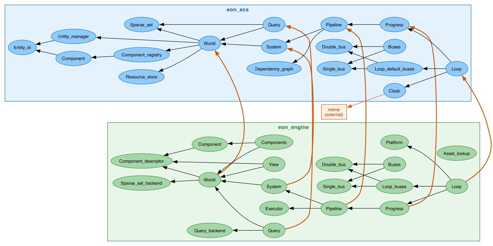

# Codebase Map

Visual reference for the structure, composition, and coverage of the `eon-ecs` and `eon-engine` packages.

Regenerate all images with:

```sh
just visualizations
```

---

## Module dependency graph

Shows embedding and dependency relationships between modules within each package, and the cross-package seam where `eon_engine` wraps `eon_ecs`.

| Arrow | Meaning |
|-------|---------|
| black thin | internal dependency within the same package |
| orange thick | cross-package: `eon_engine` depends on `eon_ecs` |

| Color | Package |
|-------|---------|
| blue | `eon_ecs` |
| green | `eon_engine` |
| tan | external (`mtime`) |



---

## Functor instantiation graph

Shows how the `Make` functors compose into `Default` concrete modules in each package. Blue = `eon_ecs`, green = `eon_engine`. Ellipses are functor arguments; filled boxes are results; dashed orange arrows show cross-package wiring.


---

## Test coverage map

Each source module colored by whether a dedicated test file exists. Green = has tests, red = no direct tests.


---

## Source lines per module

Implementation (`.ml`) line count per module, excluding tests, benchmarks, and composition roots.


---

## Interface / implementation ratio

`.mli` lines divided by `.ml` lines per module. The dashed orange line marks 1:1.

- **Ratio < 1.0** — implementation is larger than the interface; complexity is hidden behind a small public surface (good encapsulation).
- **Ratio = 1.0** — interface and implementation are the same size; little hidden machinery.
- **Ratio > 1.0** — interface is larger than the implementation; common in thin adapter modules that re-declare types from another package, or in heavily documented `.mli` files.


