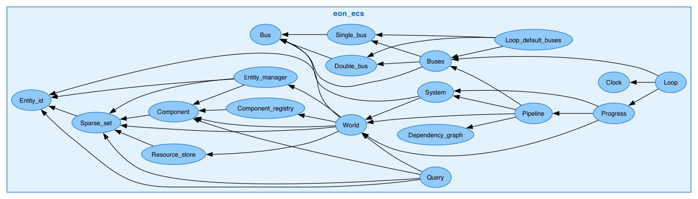
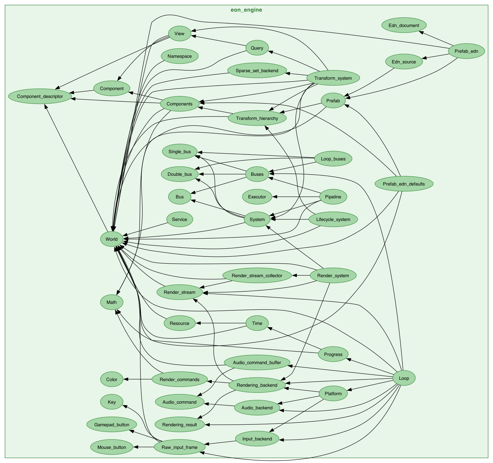
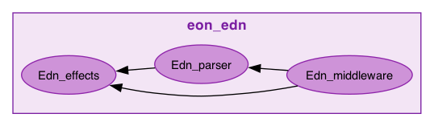
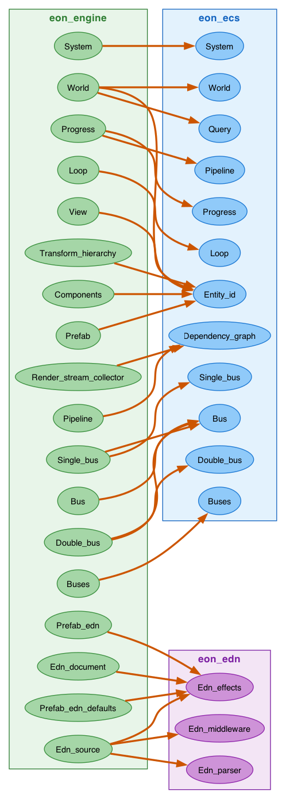
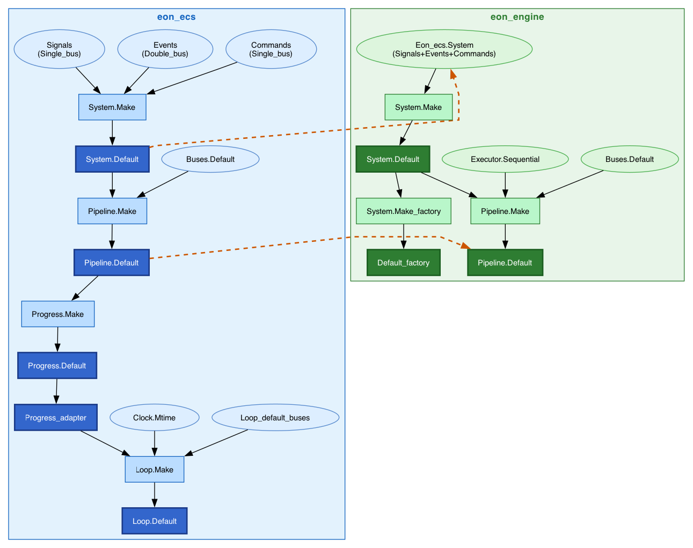
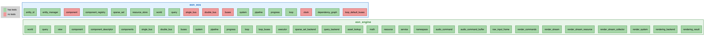
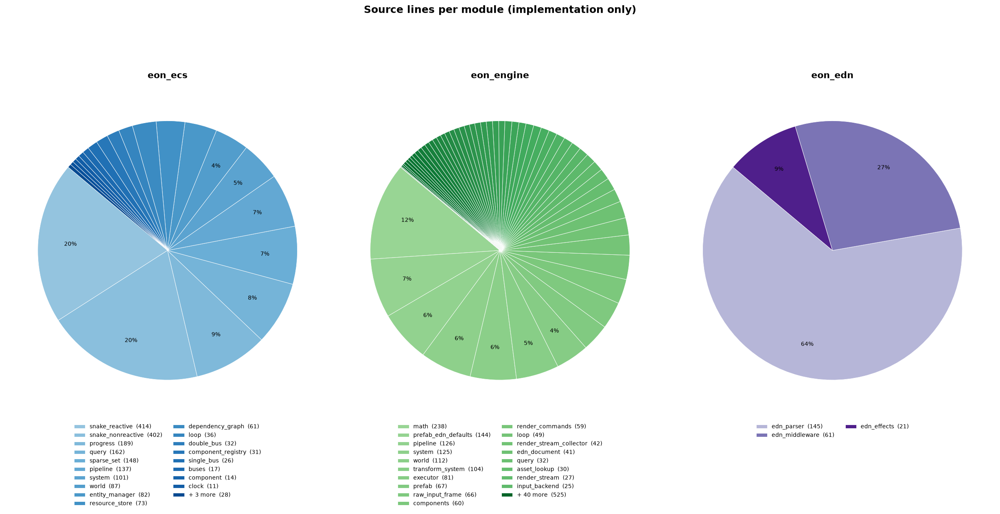
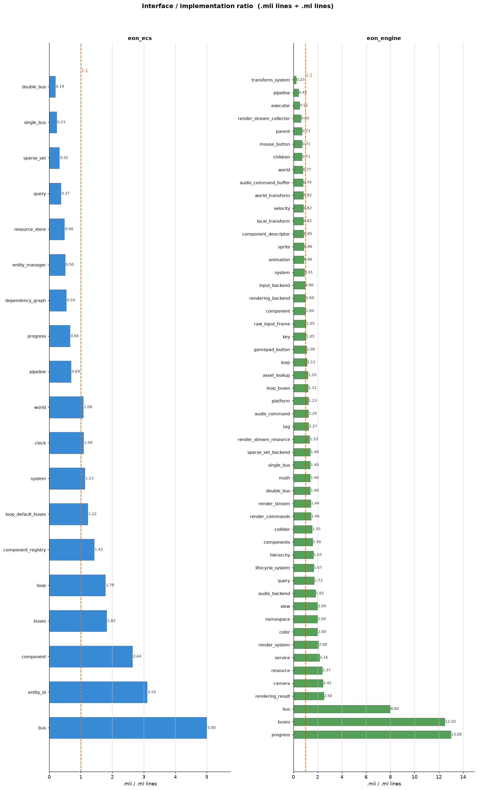

# Codebase Map

Visual reference for the structure, composition, and coverage of the `eon-ecs`, `eon-engine`, and `eon-edn` packages.

Regenerate all images with:

```sh
just visualizations
```

---

## Module dependency graphs

Dependency relationships between modules within each package, and the cross-package seams where `eon_engine` wraps `eon_ecs` and where `eon_engine`'s prefab loader depends on `eon_edn`.

| Color | Package |
|-------|---------|
| blue | `eon_ecs` |
| green | `eon_engine` |
| purple | `eon_edn` |
| tan | external (`mtime`) |

### eon_ecs internal dependencies



### eon_engine internal dependencies



### eon_edn internal dependencies

`Edn_parser` (the reader) and `Edn_middleware` (composable tag/meta handlers) both build on the `Edn_effects` AST + effect declarations. `eon_edn.ml`, the composition root, is excluded — same convention as `eon_ecs.ml`/`eon_engine.ml`.



### Cross-package seam

The orange edges show which `eon_engine` modules wrap their `eon_ecs` counterparts (same-named pairs — the engine module adds phantom capability types, bus wiring, and engine-layer API on top of the ECS primitive). The purple edges show `eon_engine`'s prefab loader (`Edn_document`, `Edn_source`, `Prefab_edn_defaults`) depending on `eon_edn`'s parser and middleware to read `.edn` prefab files.



---

## Functor instantiation graph

Shows how the `Make` functors compose into `Default` concrete modules in each package, plus the generic `Prefab.Make(Source)(Document_shape)` / `Prefab_edn.Make(Root)` instantiation chain. Blue = `eon_ecs`, green = `eon_engine`. Ellipses are functor arguments; filled boxes are results; dashed orange arrows show cross-package wiring to `eon_ecs`; the dashed purple arrow shows `Prefab_edn.Make` depending on `eon_edn`'s parser and middleware.



---

## Test coverage map

Each source module colored by whether a dedicated test file exists. Green = has tests, red = no direct tests.



---

## Source lines per module

Implementation (`.ml`) line count per module, excluding tests, benchmarks, and composition roots, one pie chart per package.



---

## Interface / implementation ratio

`.mli` lines divided by `.ml` lines per module. The dashed orange line marks 1:1.

- **Ratio < 1.0** — implementation is larger than the interface; complexity is hidden behind a small public surface (good encapsulation).
- **Ratio = 1.0** — interface and implementation are the same size; little hidden machinery.
- **Ratio > 1.0** — interface is larger than the implementation; common in thin adapter modules that re-declare types from another package, or in heavily documented `.mli` files.



---

<!-- STATS_START -->

## Code statistics

_Generated by `just visualizations` on 2026-08-02._

### Line counts

| Category | eon\_ecs | eon\_engine | eon\_edn | Total |
|---|---:|---:|---:|---:|
| Source implementation (`.ml`) | 2592 | 3483 | 435 | 6510 |
| Public interfaces (`.mli`) | 1223 | 2440 | 137 | 3800 |
| Tests | 2634 | 4077 | 396 | 7107 |
| Benchmarks | 916 | 307 | 98 | 1321 |

### Module counts

| | eon\_ecs | eon\_engine | eon\_edn | Total |
|---|---:|---:|---:|---:|
| Public modules (with `.mli`) | 20 | 59 | 4 | 83 |
| Test suites | 27 | 23 | 3 | 53 |
| Test cases | 91 | 230 | 13 | 334 |

### Repository

| | |
|---|---|
| Total commits | 307 |
| Open issues | 2 |
| Created | 2025-10-11 |
| Last commit | 2026-08-01 |

<!-- STATS_END -->
