# Module Dependency Map

Visual reference for the embedding and wrapping relationships between `eon_ecs` and `eon_engine`, and the internal dependency structure of each package.

## Reading the diagram

| Arrow | Meaning |
|-------|---------|
| `==>` thick | structural: one module **embeds or wraps** the other's type |
| `-.->` dashed | nominal: **type alias, full re-export, or functor delegation** |
| `-->` plain | **depends on** (uses, calls into) |

The key integration seam is `eon_engine.World`, which embeds `Eon_ecs.World.t` and adds component-descriptor-based addressing. `World_cap` then layers phantom `ro`/`rw` capability types on top for compile-time access control.

## Diagram

```mermaid
%%{init: {"theme": "base", "themeVariables": {"primaryColor": "#dbeafe", "primaryBorderColor": "#3b82f6", "secondaryColor": "#dcfce7", "secondaryBorderColor": "#16a34a"}}}%%
graph TD

    subgraph LEGEND["Legend"]
        direction LR
        L1["Module A"] == "embeds / wraps type" ==> L2["Module B"]
        L3["Module C"] -. "type alias / re-export / delegate" .-> L4["Module D"]
        L5["Module E"] --> L6["Module F  (depends on)"]
    end

    subgraph ECS["📦 eon_ecs"]
        direction TB

        subgraph ECS_DATA["Data layer"]
            direction TB
            ECS_EntityId["Entity_id\nindex + generation"]
            ECS_SparseSet["Sparse_set\nMake(INDEXED_KEY)"]
            ECS_Component["Component\n'a component + any_component"]
            ECS_CompReg["Component_registry\nname → any_component"]
            ECS_EntityMgr["Entity_manager\nentity lifecycle"]
            ECS_Resource["Resource_store\ndata-plane + service-plane"]
        end

        subgraph ECS_CORE["Core"]
            direction TB
            ECS_World["World\n{entities; components; resources}"]
            ECS_Query["Query\niter1..iter4 · count"]
            ECS_DepGraph["Dependency_graph\ntopological sort"]
        end

        subgraph ECS_BUS["Bus layer"]
            direction LR
            ECS_BusSig["Bus.BUS\n(module type)"]
            ECS_Single["Single_bus\ndrain = collect  same-frame"]
            ECS_Double["Double_bus\nemit→next  drain swaps  next-frame"]
        end

        subgraph ECS_RUNTIME["Runtime"]
            direction TB
            ECS_Clock["Clock · Clock.Mtime"]
            ECS_System["System\nMake(Signals)(Events)(Commands)"]
            ECS_Pipeline["Pipeline\nMake(System.S)  phase graph"]
            ECS_Progress["Progress\nVariable · Fixed · Hybrid · Custom"]
            ECS_Loop["Loop\nMake(Clock)(Progress)(Renderer)(Buses)"]
            ECS_LoopBuses["Loop_default_buses\ncollect/drain ordering"]
        end
    end

    ECS_SparseSet --> ECS_EntityId
    ECS_Component --> ECS_SparseSet
    ECS_CompReg --> ECS_Component
    ECS_EntityMgr --> ECS_EntityId
    ECS_EntityMgr --> ECS_Component
    ECS_Resource --> ECS_SparseSet
    ECS_World --> ECS_EntityMgr
    ECS_World --> ECS_CompReg
    ECS_World --> ECS_Resource
    ECS_Query --> ECS_World
    ECS_Query --> ECS_Component
    ECS_Single --> ECS_BusSig
    ECS_Double --> ECS_BusSig
    ECS_System --> ECS_BusSig
    ECS_System --> ECS_World
    ECS_Pipeline --> ECS_System
    ECS_Pipeline --> ECS_DepGraph
    ECS_Progress --> ECS_Pipeline
    ECS_Loop --> ECS_Progress
    ECS_Loop --> ECS_Clock
    ECS_LoopBuses --> ECS_Single
    ECS_LoopBuses --> ECS_Double

    subgraph ENG["📦 eon_engine"]
        direction TB

        subgraph ENG_WORLD["World layer"]
            direction TB
            ENG_World["World\ncore: Eon_ecs.World.t\nnext_id: int"]
            ENG_WorldCap["World_cap\n'perm t = {world: World.t}\nphantom:  ro=[R]  rw=[R|W]"]
        end

        subgraph ENG_QUERY["Query system"]
            direction TB
            ENG_CompDesc["Component_descriptor\n'a t = string  (component name)"]
            ENG_View["View\n{world: World.t; entity: Entity_id.t}"]
            ENG_Backend["Query_backend.S\npluggable iteration backend"]
            ENG_SSBackend["Sparse_set_backend\nMake(World.S)  default backend"]
            ENG_Query["Query\nfrom |> having |> not_having |> iter"]
            ENG_Components["Components\nPosition Velocity Rotation Scale\nSprite Animation Camera Collider Tag"]
        end

        subgraph ENG_BUS["Bus layer"]
            direction LR
            ENG_BusSig["Bus.S\n= Eon_ecs.Bus.BUS"]
            ENG_Single["Single_bus\n+ mutex  (Signals / Commands)"]
            ENG_Double["Double_bus\n+ mutex  (Events)"]
        end

        subgraph ENG_RUNTIME["Runtime"]
            direction TB
            ENG_Executor["Executor.S\nSequential (default) | custom parallel"]
            ENG_System["System\nParallel: ro World_cap → float → unit\nExclusive: rw World_cap → float → unit"]
            ENG_Pipeline["Pipeline\nMake(System.DISPATCH)(Executor.S)"]
            ENG_Progress["Progress\n≡ Eon_ecs.Progress  (full re-export)"]
            ENG_Loop["Loop\ndelegates to Eon_ecs.Loop.Make"]
            ENG_LoopBuses["Loop_buses\ncollect/drain via World services"]
        end
    end

    ENG_World --> ENG_CompDesc
    ENG_WorldCap --> ENG_World
    ENG_View --> ENG_World
    ENG_View --> ENG_CompDesc
    ENG_Backend --> ENG_CompDesc
    ENG_SSBackend --> ENG_Backend
    ENG_SSBackend --> ENG_World
    ENG_Query --> ENG_Backend
    ENG_Query --> ENG_View
    ENG_Query --> ENG_CompDesc
    ENG_Components --> ENG_World
    ENG_Components --> ENG_CompDesc
    ENG_Single --> ENG_BusSig
    ENG_Double --> ENG_BusSig
    ENG_System --> ENG_WorldCap
    ENG_System --> ENG_World
    ENG_System --> ENG_Single
    ENG_System --> ENG_Double
    ENG_Pipeline --> ENG_System
    ENG_Pipeline --> ENG_Executor
    ENG_Progress --> ENG_Pipeline
    ENG_Loop --> ENG_Progress
    ENG_LoopBuses --> ENG_World
    ENG_LoopBuses --> ENG_Single
    ENG_LoopBuses --> ENG_Double

    %% Cross-package: eon_engine → eon_ecs
    ENG_World == "embeds  core: Eon_ecs.World.t" ==> ECS_World
    ENG_WorldCap == "wraps World.t\n(which embeds Eon_ecs.World.t)" ==> ENG_World
    ENG_View -. "entity: Eon_ecs.Entity_id.t\n(transparent alias)" .-> ECS_EntityId
    ENG_Backend -. "key type: Eon_ecs.Entity_id.t" .-> ECS_EntityId
    ENG_BusSig -. "S = Eon_ecs.Bus.BUS\n(module type alias)" .-> ECS_BusSig
    ENG_Single == "wraps Eon_ecs.Single_bus\n(adds mutex)" ==> ECS_Single
    ENG_Double == "wraps Eon_ecs.Double_bus\n(adds mutex)" ==> ECS_Double
    ENG_System == "Make(Core: Eon_ecs.System.S)\nfunctor argument" ==> ECS_System
    ENG_Pipeline -. "phase ordering via\nEon_ecs.Dependency_graph" .-> ECS_DepGraph
    ENG_Progress -. "include Eon_ecs.Progress\n(full module re-export)" .-> ECS_Progress
    ENG_Loop -. "functor delegation to\nEon_ecs.Loop.Make" .-> ECS_Loop

    classDef ecsNode fill:#dbeafe,stroke:#3b82f6,color:#1e3a8a
    classDef engNode fill:#dcfce7,stroke:#16a34a,color:#14532d
    classDef legendNode fill:#f3f4f6,stroke:#9ca3af,color:#374151

    class ECS_EntityId,ECS_SparseSet,ECS_Component,ECS_CompReg,ECS_EntityMgr,ECS_Resource,ECS_World,ECS_Query,ECS_DepGraph,ECS_BusSig,ECS_Single,ECS_Double,ECS_Clock,ECS_System,ECS_Pipeline,ECS_Progress,ECS_Loop,ECS_LoopBuses ecsNode
    class ENG_World,ENG_WorldCap,ENG_CompDesc,ENG_View,ENG_Backend,ENG_SSBackend,ENG_Query,ENG_Components,ENG_BusSig,ENG_Single,ENG_Double,ENG_Executor,ENG_System,ENG_Pipeline,ENG_Progress,ENG_Loop,ENG_LoopBuses engNode
    class L1,L2,L3,L4,L5,L6 legendNode
```

