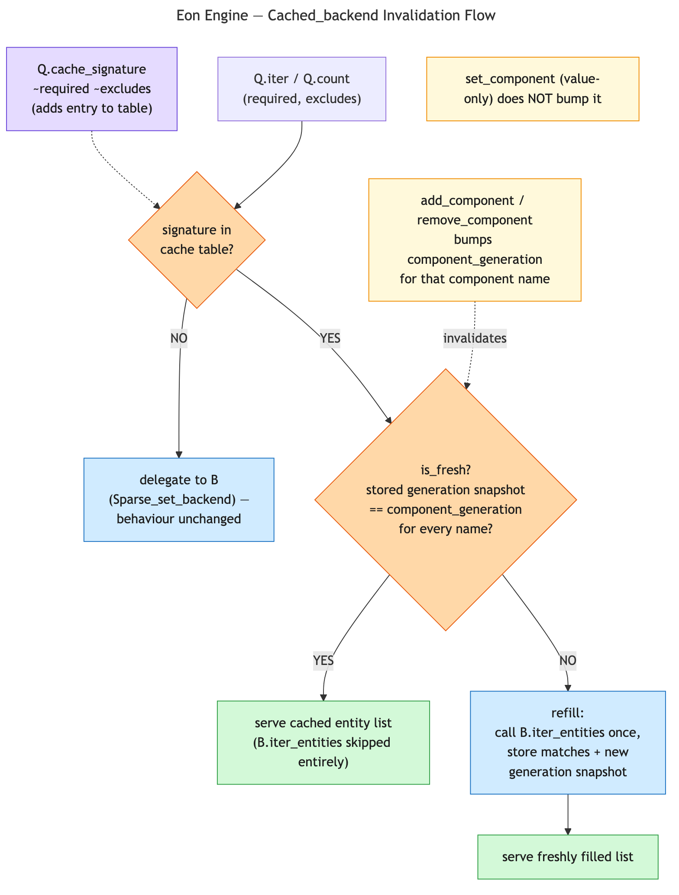

# Query Result Caching — `Cached_backend`

## Status

**IMPLEMENTED** (ecs-050, 2026-08-02). `component_generation` added to
`eon_ecs`'s `Sparse_set`/`World` and forwarded through `Eon_engine.World.S`;
`Query_backend.S` widened with `cache_signature`/`uncache_signature`
(no-op in `Sparse_set_backend`); `Cached_backend.Make` implemented exactly
as designed below, with unit tests (cache hit/miss, staleness on
add/remove, the same-tick swap case) and a QCheck property test proving
results never diverge from `Sparse_set_backend` across arbitrary
add/remove/cache/uncache sequences. Related:
[query_view_design.md](query_view_design.md) (the `Query_backend.S` this
design extends), [world_module_design.md](world_module_design.md)
§"Archetype cache dropped" (the storage-level idea this is deliberately
*not*).

---

## 1. Problem

`Query_backend.S`'s `iter_entities`/`count` (see
[query_view_design.md](query_view_design.md) §3, §6) pick the smallest of the
required component's sparse sets and walk it entirely, checking membership in
the others per entity. The cost is bound by `min(|set| for set in required)`,
**not** by the number of actual matches — a query has no way to know in
advance that two sets barely overlap.

Worked example: a grand-strategy-style game with `iter2(Province,
Infrastructure)` over a ~1M-entity world. `Infrastructure` is the smaller set
but still large in absolute terms (~200k entities) and only a few thousand of
those also carry the exact `Province` filter in play — the query walks
~200k entities to harvest a dozen matches. This is the "sparse-set adversarial
worst case" workload called out in the `eon_ecs` benchmark taxonomy: dense,
well-overlapping queries (`iter1`-style scans, majority-present components)
are the flattering case; a multi-component query where the smallest involved
set is still large and near-disjoint from the others is sparse-set's honest
worst case, with no equivalent in archetype-based ECS designs (where it shows
up instead as table fragmentation).

The waste is exactly `min-set-size - match-count`, repeated every call —
including every frame, for a query a system runs once per frame.

---

## 2. Non-goal: this is not the archetype cache

`eon_ecs`/`eon_engine` already considered and dropped a full archetype/table
storage backend as premature (see [world_module_design.md](world_module_design.md),
"Archetype cache dropped": `Bitset`, `Archetype_index`, `Archetype_backend`,
`World.Make`, and a `TRACKING` signature were all removed as unjustified
complexity). This design does not reopen that. Storage stays exactly what it
is today — one `Sparse_set` per component, no tables, no archetypes. Only the
*query* layer gains an optional cache, sitting entirely inside the one
pluggable seam that already exists (`Query_backend.S`). If a real archetype
backend is ever built, it would satisfy `Query_backend.S` like any other
backend and could be wrapped by `Cached_backend` the same way — but nothing
here depends on that happening.

---

## 3. Design goals

1. **Additive, not a fork.** No changes to `Query.Make`, `World`, or the
   filter-building half of the builder. Whether caching is active for a given
   query is a property of which backend module is plugged in, not a
   separate API surface.
2. **Selective, not blanket.** Caching only pays off when the raw walk was
   doing a lot of rejecting. A dense, high-match-rate query gains little and
   may lose (materializing and storing a large entity list costs something
   too) — so caching is opt-in per query signature, never automatic for every
   query that flows through a backend.
3. **Manual selection, not adaptive/statistics-driven.** A self-tuning cache
   that tracks hit/reject rates per signature and decides on its own what to
   cache is explicitly out of scope, for two reasons:
   - It makes cache state depend on accumulated runtime history, which fights
     the project's deterministic-benchmark culture (permutations prepared
     outside timing, comparable runs) — "was this frame slow because of real
     work, or because the cache hadn't warmed up yet" is a debugging path this
     design avoids introducing.
   - It doesn't match the codebase's grain. `System.Make`, `Pipeline.Make`,
     `Progress.Make` are all explicit, developer-opted-into composition — no
     module infers its own configuration at runtime.

   The manual flow: an `eon_ecs`-workload-style benchmark identifies a
   pathological signature (the adversarial-worst-case workload from §1); the
   developer registers that specific signature via `cache_signature`.

---

## 4. Prior art in this codebase

The shape mirrors two things already in place:

- **Backend-as-plugpoint**: `Query.Make (B : Query_backend.S)` already
  decouples the query builder from any specific backend
  ([query_view_design.md](query_view_design.md) §5-§6). A cache is just
  another backend.
- **Default-vs-explicit-composition**: `Eon_ecs.System.Default =
  System.Make(Signals)(Events)(Commands)` picks concrete bus implementations
  rather than branching the `System` functor itself
  ([parallel_pipeline_execution.md](parallel_pipeline_execution.md)). The
  same pattern applies here: `Query.Default` stays cheap-and-dumb
  (`Sparse_set_backend`, cache operations are no-ops); a game that wants
  selective caching plugs in `Cached_backend.Make(World)(Sparse_set_backend.Default)`
  instead and calls `cache_signature` for its known-adversarial signatures.

---

## 5. `Query_backend.S` extension

Widen the existing signature
([query_backend.mli](../../eon_engine/src/query_backend.mli)) with two
operations. No parallel `Query.Make_with_cache` functor:

```ocaml
module type S = sig
  type 'perm world

  val iter_entities :
    'perm world ->
    required:string list ->
    excludes:string list ->
    (Eon_ecs.Entity_id.t -> unit) ->
    unit

  val count :
    'perm world ->
    required:string list ->
    excludes:string list ->
    int

  (* New: *)
  val cache_signature   : required:string list -> excludes:string list -> unit
  (** Opt this exact (required, excludes) signature into caching. No-op on a
      backend that does not implement caching. *)

  val uncache_signature : required:string list -> excludes:string list -> unit
  (** Undo [cache_signature]. No-op if the signature was never cached. *)
end
```

`Query.Make` itself does not change — it already only depends on `B :
Query_backend.S`. It re-exposes `cache_signature`/`uncache_signature`
unconditionally as pass-throughs to `B`, the same way it dispatches `iter`/
`count` today.

`Sparse_set_backend` ([sparse_set_backend.mli](../../eon_engine/src/sparse_set_backend.mli))
implements both new operations as no-ops — two lines, no behavior change for
existing code that never calls them.

---

## 6. `Cached_backend.Make`

```ocaml
module Cached_backend : sig
  module Make (W : World.S) (B : Query_backend.S with type 'perm world = 'perm W.t)
    : Query_backend.S with type 'perm world = 'perm W.t
end
```

`W` supplies `component_generation` (§7); `B` is the backend being wrapped
— the same two-argument shape `Sparse_set_backend.Make (W : World.S)` already
uses, just with one more argument since `Cached_backend` also needs a
backend to delegate to, not only a world.

Concretely, "`W` supplies it" means `world.ml`'s concrete `World` module
forwards straight through to the `eon_ecs` primitive on its wrapped `core`
field — no new logic, just a pass-through, same as `iter_entities`/
`has_component` already do:

```ocaml
(* eon_engine/src/world.ml — 'perm t already = { core : Eon_ecs.World.t; ... } *)
let component_generation world name = Eon_ecs.World.component_generation world.core name
```

Any other `W : World.S` implementation (the "roll your own" custom-world
case) is free to supply `component_generation` however it likes — `Cached_backend`
only depends on the signature, not on this specific forwarding body.

Holds internal mutable state — a hash table keyed by the normalized
`(required, excludes)` signature (§8), mapping to a materialized match set
plus the per-component generation snapshot (§7). This is the same
"module-level mutable state created once at instantiation" pattern
`Single_bus`/`Double_bus` already use, not a new idiom.

- `cache_signature`/`uncache_signature` add/remove entries in that table.
- `iter_entities`/`count`, for a signature present in the table: check
  freshness by comparing the stored generation snapshot against
  `component_generation` for each name in the signature (§7); if fresh,
  iterate/count the cached matches directly, skipping `B.iter_entities`
  entirely; if stale (or the signature isn't cached), fall through to
  `B.iter_entities`/`B.count` and, if cached, refill the entry and its
  generation snapshot.

Usage:

```ocaml
module Q = Query.Make (Cached_backend.Make (World) (Sparse_set_backend.Default))

(* register as many pathological signatures as the benchmarks turn up — each
   call adds one independent entry, keyed on its own (required, excludes) *)
let () = Q.cache_signature ~required:["Province"; "Infrastructure"] ~excludes:[]
let () = Q.cache_signature ~required:["Unit"; "Supply_line"] ~excludes:["Destroyed"]

(* subsequent Q.from world |> Q.having_all [...] |> Q.iter ... hits the cache
   for any registered signature; every other signature behaves exactly as
   Sparse_set_backend.Default would *)
```

### Illustrative implementation

The signature and prose above are enough to build from, but concrete shape
makes the freshness-check flow easier to follow than a description of it.
This is illustrative, not a literal diff to apply — real code would live in
`eon_engine/src/cached_backend.ml`.

The functor is parameterized over `(W : World.S)` in addition to the backend
it wraps, exactly the way `Sparse_set_backend.Make (W : World.S)` already is
— not pinned to `Eon_ecs.World.t`, and not left fully backend-agnostic
either, since `component_generation` (§7) has to come from *some* concrete
`World.S`. `W` and `B` share their world type by construction:

```ocaml
(* lives in cached_backend.ml, referenced externally as Cached_backend.Make —
   same file/module-naming convention as sparse_set_backend.ml's own Make *)
module Make
    (W : World.S)
    (B : Query_backend.S with type 'perm world = 'perm W.t)
  : Query_backend.S with type 'perm world = 'perm W.t
= struct
  type 'perm world = 'perm W.t

  (* Normalized signature: sorted + deduped, per §8. *)
  type key = string list * string list

  type entry = {
    mutable entities    : Eon_ecs.Entity_id.t list;
    (* One generation snapshot per component name involved, from §7. *)
    mutable generations : (string * int) list;
  }

  let normalize names = List.sort_uniq String.compare names

  let key_of ~required ~excludes : key = (normalize required, normalize excludes)

  (* One table, shared by every Query.Make instance built over this
     Cached_backend module — same "module-level mutable state" pattern
     Single_bus/Double_bus already use. *)
  let cache : (key, entry) Hashtbl.t = Hashtbl.create 16

  let cache_signature ~required ~excludes =
    let k = key_of ~required ~excludes in
    if not (Hashtbl.mem cache k) then
      Hashtbl.add cache k { entities = []; generations = [] }

  let uncache_signature ~required ~excludes =
    Hashtbl.remove cache (key_of ~required ~excludes)

  (* Fresh iff every involved component's live generation still matches what
     was snapshotted at the last fill. *)
  let is_fresh world entry names =
    List.for_all
      (fun name ->
        match List.assoc_opt name entry.generations with
        | None -> false
        | Some snapshot -> snapshot = W.component_generation world name)
      names

  let refill world entry ~required ~excludes =
    let matches = ref [] in
    B.iter_entities world ~required ~excludes (fun e -> matches := e :: !matches);
    entry.entities <- !matches;
    entry.generations <-
      List.map
        (fun name -> (name, W.component_generation world name))
        (required @ excludes)

  (* Shared by iter_entities and count: look the signature up, refill if
     missing or stale, then hand the (now-fresh, or absent) entry to the
     caller. [on_uncached] is exactly today's uncached behaviour — a
     signature nobody called [cache_signature] on behaves identically to
     plain [B]. *)
  let with_entry world ~required ~excludes ~on_cached ~on_uncached =
    match Hashtbl.find_opt cache (key_of ~required ~excludes) with
    | None -> on_uncached ()
    | Some entry ->
      if not (is_fresh world entry (required @ excludes)) then
        refill world entry ~required ~excludes;
      on_cached entry

  let iter_entities world ~required ~excludes f =
    with_entry world ~required ~excludes
      ~on_uncached:(fun () -> B.iter_entities world ~required ~excludes f)
      ~on_cached:(fun entry -> List.iter f entry.entities)

  let count world ~required ~excludes =
    with_entry world ~required ~excludes
      ~on_uncached:(fun () -> B.count world ~required ~excludes)
      ~on_cached:(fun entry -> List.length entry.entities)
end
```

Walked through once, concretely: frame 1 calls `Q.iter` for `(["Province";
"Infrastructure"], [])` — `cache_signature` already registered it, so
`Hashtbl.find_opt` finds an empty `entry`, `is_fresh` is trivially false (no
generations recorded yet), `refill` walks `B.iter_entities` once (the full
~200k-entity cost from §1), stores the dozen matches, and snapshots both
components' current generations. Frames 2 through N call the same signature
again: `is_fresh` now finds matching snapshots (nothing bumped `Province` or
`Infrastructure`'s generation), so `iter_entities` skips `B.iter_entities`
entirely and just walks the cached dozen. Whenever gameplay code adds or
removes `Infrastructure` on some entity, `component_generation` for
`"Infrastructure"` bumps — the next `is_fresh` check for this signature fails,
and exactly one `refill` happens before the cache goes fresh again.

---

## 7. Invalidation: `component_generation`

`iter_entities`/`count` take a fresh `'perm world` on every call — there is no
mutation hook that tells a wrapping backend "Infrastructure's sparse set just
changed." `Sparse_set.length` is not a valid proxy: a same-tick swap (remove
one entity's component, add a different entity's in the same component)
leaves length unchanged, so a length-keyed cache would go stale silently.
That's a correctness bug, not an acceptable approximation, and it rules out
reusing anything currently exposed.



([editable source](diagrams/query_cache_invalidation.mmd))

The design adds one new primitive, in two places — the source of truth in
`eon_ecs`, forwarded through `eon_engine`'s own `World.S`:

```ocaml
(* eon_ecs — new public accessor (eon_ecs.mli), backed by a new
   mutable version : int field on sparse_set.ml's record, incremented in
   both the insert and remove branches only (not on value-only updates to
   an already-present component, i.e. set_component does NOT bump it) *)
val component_generation : t -> string -> int
(** Monotonically increasing counter for the named component's sparse set,
    bumped on every add_component/remove_component that changes its
    membership. Raises if unregistered, consistent with get_component. *)
```

```ocaml
(* eon_engine's World.S (world.mli) — forwards to the above on the
   wrapped Eon_ecs.World.t core, alongside iter_entities/has_component *)
val component_generation : 'perm t -> string -> int
```

Nothing today tracks structural mutation that either of these could reuse
instead — `Entity_id`'s `generation` field is a different concept entirely (a
per-entity-*slot* counter, bumped only on despawn/index reuse, used to
invalidate stale handles referencing a recycled slot; it says nothing about a
component's membership set).

`Cached_backend` snapshots `component_generation world name` for every name in
a cached signature at fill time, and compares the snapshot against the
current value on every read; any mismatch invalidates that entry (and only
that entry). The `eon_ecs` addition is a real, additive commitment to its
public, frozen-but-additive API surface (`eon_ecs.mli`) — small and targeted,
in the same spirit as `iter_entities` itself.

`Cached_backend` itself never calls `Eon_ecs.World.component_generation`
directly, though — it goes through `Eon_engine.World.S`
([world.mli](../../eon_engine/src/world.mli)), the signature
`Sparse_set_backend.Make` is already parameterized over
(`Sparse_set_backend.Make (W : World.S) : Query_backend.S with type 'perm
world = 'perm W.t`; `Default = Make(World)` plugs in the concrete wrapper).
`Eon_engine.World.t` already wraps `Eon_ecs.World.t` as its `core` field, which
is why `World.S`'s version above can just forward to it. `Cached_backend` is
then parameterized over `(W : World.S)` the same way `Sparse_set_backend.Make`
is, rather than pinned to `Eon_ecs.World.t` — see §6. This keeps a custom
`World.S` implementation (the "roll your own" case `sparse_set_backend.mli`
already documents) eligible for caching too, instead of `Cached_backend`
special-casing the concrete engine world type.

Note `cache_signature`/`uncache_signature` (§5) are unrelated to this
primitive and never touch `World` at all — their type
(`required:string list -> excludes:string list -> unit`) takes no `world`
argument. They're pure bookkeeping on `Cached_backend`'s own internal table
(which signatures to track), a static developer decision independent of any
specific world instance. `component_generation` is the only place a `world`
value is consulted, and only inside `iter_entities`/`count`, at read time.

---

## 8. Cache key normalization

`having_all [Province; Infrastructure]` and `having_all [Infrastructure;
Province]` must hit the same cache entry — the builder does not guarantee
list order is stable relative to call-site argument order. `Cached_backend`
sorts and dedupes `required` and `excludes` independently before using the
resulting pair as the `Hashtbl` key; OCaml's structural hash and equality on a
sorted string-list pair are already exactly order-independent, and sorting a
handful of short strings (a query signature realistically has 2-6 component
names) costs nothing worth optimizing. No custom hash function — a hand-rolled
commutative hash (e.g. XOR-folding each name's hash) would only pay for itself
at list sizes far larger than a query signature ever has, and it introduces
real risk for no benefit: a hash collision between two *different* signatures
is only safe if the canonical list is also stored for a fallback equality
check, which is exactly what `Hashtbl`'s built-in equality already gives for
free on the sorted-list key.

---

## 9. What NOT to do

- **Do not fork `Query.Make` into a caching variant.** One functor, one API
  surface — caching is a backend property, not a query-builder mode.
- **Do not make caching automatic/blanket.** Every signature cached
  unconditionally would tax the dense, already-efficient queries that don't
  need it, for the benefit of the sparse ones that do.
- **Do not build a self-tuning/adaptive cache.** See §3 — deliberately out of
  scope, not just deferred.
- **Do not use sparse-set length (or count) as a staleness proxy.** See §7 —
  this is a correctness bug, not an acceptable approximation.
- **Do not reopen the archetype-backend question here.** See §2 — this is
  additive to the existing sparse-set backend, not a storage-model change.
- **Do not bump `component_generation` on value-only updates.** `set_component`
  on an already-present component changes a value, not membership — queries
  only care about the latter (§7).
- **Do not build a custom order-independent hash function.** Sort + dedupe
  and let `Hashtbl`'s structural equality do the work (§8).

---

## Related

- [query_view_design.md](query_view_design.md) — the `Query_backend.S` /
  `Query.Make` this design extends.
- [world_module_design.md](world_module_design.md) — "Archetype cache
  dropped" section: the storage-level idea this design is deliberately
  smaller than.
- [parallel_pipeline_execution.md](parallel_pipeline_execution.md) — prior
  art for default-vs-explicit backend composition (`System.Default` picking
  concrete bus implementations).
