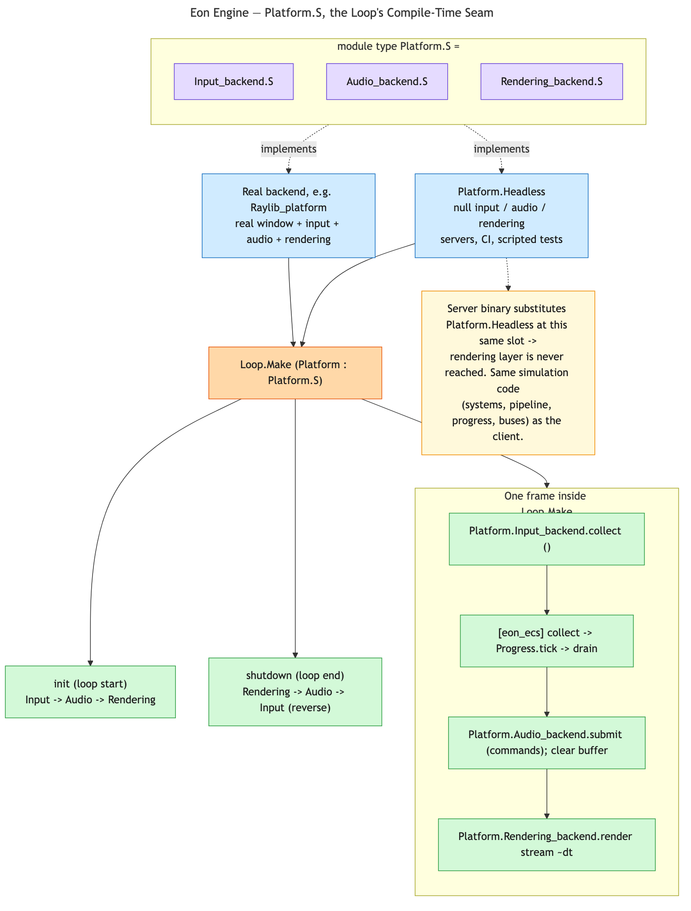

# Eon Engine Rendering Layer Design Document

**Status**: IMPLEMENTED (ecs-031).

## 1. Overview

The rendering layer is backend-agnostic: the engine defines a data vocabulary and the infrastructure to populate it; the backend decides how to render it. The engine and ECS core have no opinion on rendering technique, draw order, or shader usage.

Four components collaborate to produce a frame:

1. **Render_stream** — an ordered world-space command list and a screen-space command list; no entity references. The stream is the data contract between the ECS tick and the render call.
2. **Render_stream_collector** — runs game-supplied collectors in phase order to populate the stream each frame.
3. **Render_system** — a standard ECS system that clears the stream, runs the collector, and stores the result in the world data plane. It never calls the backend.
4. **Rendering_backend** — receives the populated stream and produces pixels. Called by the engine loop after drain, via `Platform.S`.

### Frame Flow

```
1. collect  — Signals → Events → Commands
2. tick     — Progress.tick; Render_system runs:
                clear Render_stream → run Render_stream_collector → store reference in data plane
3. drain    — Signals → Commands → Events
4. render   — engine loop reads Render_stream from data plane,
               calls Platform.Rendering_backend.render graph ~dt
```

The world data plane is the handoff point between tick and render. `eon_ecs` Loop stays `collect → tick → drain` only — the render slot is exclusively an `eon_engine` concern.

## 2. Color

`Color` is a standalone `eon_engine` module — it is a rendering concern and does not live in `Math`. Each backend converts `Color.t` to its own internal representation at render time.

```ocaml
(* eon_engine/render/color.mli *)
type t = { r : float; g : float; b : float; a : float }

val create      : float -> float -> float -> float -> t
val white       : t
val black       : t
val transparent : t
```

## 3. Base Command Set

Seven backend-agnostic commands cover a complete 2D game. The command stream is ordered — collectors run in phase order, and the backend processes commands in the order they appear. This gives the backend a fully deterministic, ordered buffer to work with; batching, grouping by camera, and sorting by layer are all backend responsibilities.

`Render_commands` uses `Math.Rect.t` and `Color.t` directly — no duplicate type definitions.

OCaml polymorphic variants do not support inline records, so each complex payload is a named record type:

```ocaml
(* eon_engine/render/render_commands.mli *)

type camera = {
  position : float * float;
  zoom     : float option;
  rotation : float option;          (* radians; None = 0.0 *)
  target   : (float * float) option;
  viewport : Math.Rect.t option;    (* None = full screen *)
}

type texture = {
  texture_id : string;
  source     : Math.Rect.t option;  (* None = full texture; Some r = sprite sheet region *)
  dest       : Math.Rect.t;
  rotation   : float option;
  origin     : (float * float) option;  (* rotation pivot, dest-local coords *)
  tint       : Color.t option;
  layer      : int;
}

type text = {
  text     : string;
  position : float * float;
  font_id  : string;
  size     : float;
  color    : Color.t;
  layer    : int;
}

type rect_cmd = { rect : Math.Rect.t; color : Color.t; filled : bool; layer : int }
type circle   = { center : float * float; radius : float; color : Color.t; filled : bool; layer : int }
type line     = { start : float * float; stop : float * float; thickness : float; color : Color.t; layer : int }

type command = [
  | `Clear_background of Color.t
  | `Set_camera       of camera
  | `Draw_texture     of texture
  | `Draw_text        of text
  | `Draw_rect        of rect_cmd
  | `Draw_circle      of circle
  | `Draw_line        of line
]
```

`Draw_texture` unifies texture, sprite, and image drawing via the optional `source` rect. Animation is not a render command — `Animation_system` updates the source rect on the `Sprite` component each tick; the collector emits the current frame. `tint` enables hit flash, transparency, and colour effects without a shader. `filled` covers both fill and outline variants with one command.

A backend extends the base set via polymorphic variant inclusion:

```ocaml
type command = [
  | Render_commands.command
  | `Apply_shader   of shader
  | `Draw_particles of particle_system
]
```

## 4. Render_stream

The stream holds two coordinate spaces. **World space** is an ordered list of commands — `Set_camera` followed by draw commands, repeated for each camera. **Screen space** is a flat list fixed to the screen regardless of camera; HUD, UI, damage numbers.

`Render_stream` is backed by `Dynarray` (OCaml 5.2 stdlib). `clear` sets the length to zero but retains the backing array, so steady-state frames after the first produce zero minor allocations. Confirmed by `bench_render_stream` (Q1).

```ocaml
(* eon_engine/render/render_stream.mli *)

type 'command t  (* abstract *)

val create     : unit -> 'command t
val clear      : 'command t -> unit
val add_world  : 'command t -> 'command -> unit
val add_screen : 'command t -> 'command -> unit
val iter_world  : 'command t -> ('command -> unit) -> unit
val iter_screen : 'command t -> ('command -> unit) -> unit
```

## 5. Render_stream_collector

The `Render_stream_collector` organises collectors into named phases backed by `Phase_graph` from `eon_ecs`. Phase ordering is declared explicitly via `~after` — the same model as `Pipeline.before`/`Pipeline.after` — so there is no global declaration-order dependency. This makes multi-camera layouts safe: each camera phase declares itself relative to what it knows about, not relative to a centrally maintained list.

Collectors within a phase execute in addition order. Both phases and collectors within a phase are sequential — no coordination overhead, fully deterministic command stream. A developer needing parallel collection can collect into per-collector private streams and merge them sequentially into the main stream at the end of a phase; the engine does not provide this infrastructure.

A collector is `World.ro World.t -> 'command Render_stream.t -> unit`. `World.ro` is enforced by type — collectors never mutate world state. The engine ships no collectors; it cannot know which components a game uses or how rendering data is structured.

```ocaml
(* eon_engine/render/render_stream_collector.mli *)

type ('phase, 'command) t
type 'command collector = World.ro World.t -> 'command Render_stream.t -> unit

val create        : unit -> ('phase, 'command) t
val add_phase     : ?after:'phase -> 'phase -> ('phase, 'command) t -> ('phase, 'command) t
(** Add a phase. [~after] declares that [after] runs before the new phase.
    Raises [Invalid_argument] if [~after] names an unknown phase.
    Idempotent if the phase already exists with the same ordering. *)
val add_collector : 'phase -> 'command collector -> ('phase, 'command) t -> ('phase, 'command) t
val collect       : ('phase, 'command) t -> World.ro World.t -> 'command Render_stream.t -> unit
```

```ocaml
(* Camera collector — one collector per camera role, not one for all cameras.
   Each collector queries positively for its role marker — adding a new camera
   type never breaks existing collectors. *)
let collect_main_camera (world : World.ro World.t) graph =
  Query.from world
  |> Query.having Components.Local_transform.name
  |> Query.having Components.Camera.name
  |> Query.having Components.Main_camera.name
  |> Query.iter (fun view ->
       let transform = View.get view (module Components.Local_transform) in
       let camera    = View.get view (module Components.Camera) in
       Render_stream.add_world graph (`Set_camera {
         position = (transform.position.x, transform.position.y);
         zoom     = Some camera.zoom;
         rotation = camera.rotation;
         target   = None;
         viewport = camera.viewport;
       }))

(* Sprite collector *)
let collect_sprites (world : World.ro World.t) graph =
  Query.from world
  |> Query.having Components.Local_transform.name
  |> Query.having Components.Sprite.name
  |> Query.iter (fun view ->
       let transform = View.get view (module Components.Local_transform) in
       let sprite    = View.get view (module Components.Sprite) in
       Render_stream.add_world graph (`Draw_texture {
         texture_id = sprite.texture_id;
         source     = sprite.source_rect;
         dest       = Math.Rect.create transform.position.x transform.position.y sprite.w sprite.h;
         rotation   = None; origin = None; tint = None;
         layer      = sprite.layer;
       }))
```

### Multi-camera

Each camera gets its own pair of phases. The `~after` ordering keeps each camera's setup phase immediately before its draw phase:

```ocaml
let collector =
  Render_stream_collector.create ()
  |> add_phase `Main_camera
  |> add_phase `Main_world       ~after:`Main_camera
  |> add_phase `Minimap_camera   ~after:`Main_world
  |> add_phase `Minimap_world    ~after:`Minimap_camera
  |> add_phase `Screen           ~after:`Minimap_world
  |> add_collector `Main_camera   collect_main_camera
  |> add_collector `Main_world    collect_sprites
  |> add_collector `Minimap_camera collect_minimap_camera
  |> add_collector `Minimap_world  collect_minimap_icons
```

Adding a third camera later is two more `add_phase` lines — no central list to edit.

### Multi-camera and Marker Components

The minimap is not a special case — it is a second lens over the same entities. For minimap visibility, a `Minimap_icon` component serves as both the opt-in signal and the data source:

```ocaml
(* minimap_icon.mli *)
type t = {
  texture_id : string;
  color      : Color.t;
  size       : float;
}
```

This covers two cases with one component:

- **World entity shown on minimap**: has `Sprite` (world rendering) + `Minimap_icon` (minimap rendering)
- **Minimap-only entity** (waypoint, zone boundary, quest marker): has `Minimap_icon` but no `Sprite`

## 6. Rendering_backend

The backend receives an already-populated `Render_stream` and has complete autonomy over rendering decisions. Non-fatal errors are returned in `Rendering_result.t`; truly fatal errors (GPU lost, out of memory) raise exceptions.

```ocaml
(* eon_engine/render/rendering_result.mli *)
type t = { errors : string list }

val empty      : t
val has_errors : t -> bool
```

```ocaml
(* eon_engine/render/rendering_backend.mli *)

module type S = sig
  type command

  val init        : unit -> unit
  val render      : command Render_stream.t -> dt:float -> Rendering_result.t
  val diagnostics : unit -> (string * string) list
  val shutdown    : unit -> unit
end
```

The backend iterates the world stream and tracks camera state as it goes:

```ocaml
(* Raylib backend — naive single-pass implementation for illustration. *)
let render graph ~dt:_ =
  Raylib.begin_drawing ();
  let camera_active = ref false in
  Render_stream.iter_world graph (function
    | `Set_camera cam ->
        if !camera_active then Raylib.end_mode_2d ();
        Raylib.begin_mode_2d (to_raylib_camera cam);
        camera_active := true
    | cmd -> dispatch cmd
  );
  if !camera_active then Raylib.end_mode_2d ();
  Render_stream.iter_screen graph dispatch_screen;
  Raylib.end_drawing ()
```

### Asset Loading

There is no central asset manager. Each backend owns its GPU handles and font atlases from `init` to `shutdown`. Game code uses only stable string identifiers (`texture_id`, `font_id`); the backend resolves those to internal handles at render time.

```ocaml
module Raylib_renderer (Assets : Asset_lookup.S) : Rendering_backend.S = struct
  let init () =
    InitWindow (...);
    Assets.iter (fun logical_id path -> preload_texture logical_id path)
  ...
end
```

The directory structure is the manifest:

```
assets/
  sprites/player.png  →  texture_id: "sprites/player.png"
  fonts/ui.ttf        →  font_id:    "fonts/ui.ttf"
```

## 7. Render_system

```ocaml
(* eon_engine/render/render_system.mli *)

(** General form — use when wiring into a custom pipeline built via
    [System.Make] / [Pipeline.Make]. *)
module Make_with_system
    (B   : Rendering_backend.S)
    (Sys : System.DISPATCH) : sig
  val make
    :  render_stream_collector:('phase, B.command) Render_stream_collector.t
    -> (unit, unit, unit) Sys.t
end

(** Convenience alias: [Make_with_system(B)(System.Default)]. *)
module Make (B : Rendering_backend.S) : sig
  val make
    :  render_stream_collector:('phase, B.command) Render_stream_collector.t
    -> (unit, unit, unit) System.Default.t
end
```

The system owns a `Render_stream` created once in `make`. Each frame it clears the stream, runs the collector to repopulate it, then stores a reference in the world data plane via `World.set_data` for the engine loop to read. No allocation per frame. The system never calls the backend.

The world data plane (`World.get_data` / `World.set_data`) is a temporary keyed store used for engine-internal handoff. It will be replaced by `Resource.S` when that is designed.

## 8. Platform.S and Loop Integration

```ocaml
(* eon_engine/platform.mli — Rendering_backend added to existing S *)

module type S = sig
  type t
  module Input_backend     : Input_backend.S
  module Audio_backend     : Audio_backend.S
  module Rendering_backend : Rendering_backend.S
end

(* Headless extended with Rendering_backend.Null *)
module Headless : S with type t = [ `Headless ]
```

```ocaml
let step ~progress ~world ~last_time ~now ~should_continue =
  let raw = Platform.Input_backend.collect () in
  Raw_input_frame.set world raw;
  Buses.collect ();
  let dt    = now -. last_time in
  let world = Progress.tick progress ~world ~dt in
  Buses.drain ();
  let graph  = World.get_data world `Render_stream in
  let result = Platform.Rendering_backend.render graph ~dt in
  if Rendering_result.has_errors result then
    List.iter (fun e -> Printf.eprintf "[renderer] %s\n" e) result.errors;
  (world, now, should_continue world)
```



([editable source](diagrams/platform_seam.mmd))

`Loop.Make` closes over a `Platform : Platform.S` module at the functor
boundary — the trifecta (`Input_backend`, `Audio_backend`,
`Rendering_backend`) is a single compile-time seam, not three independent
parameters. Two instances are relevant:

- **`Platform.Headless`** — null input, audio, and rendering backends
  (`Rendering_backend.Null` discards every command). Substituted at exactly
  this slot for servers, CI, and scripted simulation.
- **A real platform** (e.g. a Raylib-backed module satisfying `Platform.S`)
  — the window/input/audio/rendering backends a client binary uses.

This is the client/server split point for the listen-server multiplayer
model in
[grimdawn-style-multiplayer-distributed-buses.md](grimdawn-style-multiplayer-distributed-buses.md):
a server binary instantiates `Loop.Make` with `Platform.Headless` and never
reaches the rendering layer at all; a client binary instantiates the same
`Loop.Make` with a real platform. All simulation code — systems, pipeline,
progress, buses — is identical between the two; only this one functor
argument differs.

`Loop.run` calls `init` on all three backends before the loop starts, and
their `shutdown` counterparts, **in reverse order**, after it returns
(`eon_engine/loop.mli`): `Input_backend.init` → `Audio_backend.init` →
`Rendering_backend.init`, then at shutdown `Rendering_backend.shutdown` →
`Audio_backend.shutdown` → `Input_backend.shutdown`.

## 9. UI Rendering

Specified in `docs/design/microui_ui_system_design.md`. Deferred until the core rendering layer is implemented.

## 10. Wiring Example

```ocaml
let render_stream_collector =
  Render_stream_collector.create ()
  |> Render_stream_collector.add_phase `Camera
  |> Render_stream_collector.add_phase `World ~after:`Camera

  |> Render_stream_collector.add_collector `Camera Game.collect_main_camera
  |> Render_stream_collector.add_collector `World  Game.collect_sprites
  |> Render_stream_collector.add_collector `World  Game.collect_particles

module My_render_system = Render_system.Make(My_platform.Rendering_backend)
let render_system = My_render_system.make ~render_stream_collector

let ecs_pipeline =
  Pipeline.create ()
  |> Pipeline.add_phase `Render
  |> Pipeline.add_system `Render render_system

module Loop = Eon_engine.Loop.Make
  (Eon_ecs.Clock.Mtime)(Engine_progress)(My_platform)(Eon_engine.Loop_buses)

let () =
  let progress = Engine_progress.create ~mode:Progress.Variable pipeline in
  Loop.run ~progress ~world ~should_continue:(fun _ -> true) ()
```

## 11. Key Decisions

| Decision | Choice | Rationale |
|----------|--------|-----------|
| `Phase_graph` in `eon_ecs` | Extracted from `Pipeline` internals | Avoids duplicating topo-sort logic in `eon_engine`; `Pipeline` refactored to use it with no public API change |
| `Color` in `eon_engine` | Standalone module | Rendering concern, not a math primitive; backends convert to their own internal type |
| `Render_commands` types | Uses `Math.Rect.t` and `Color.t` | No duplicate type definitions |
| Phase ordering | `~after` on `add_phase` | Same model as `Pipeline`; safe for multi-camera without a central declaration list |
| Data plane handoff | `World.get_data` / `World.set_data` | Temporary; replaced by `Resource.S` in a later task |
| No built-in collectors | Engine ships none | Cannot know which components a game uses |
