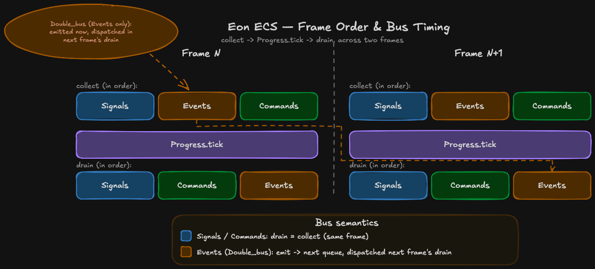
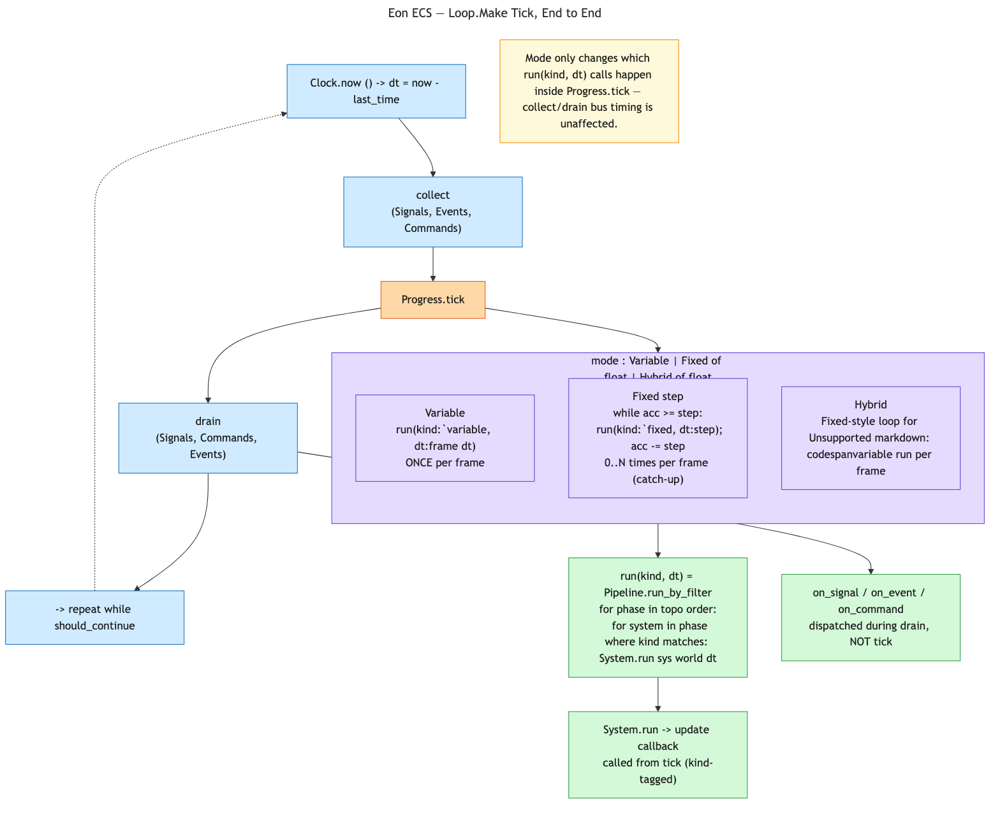
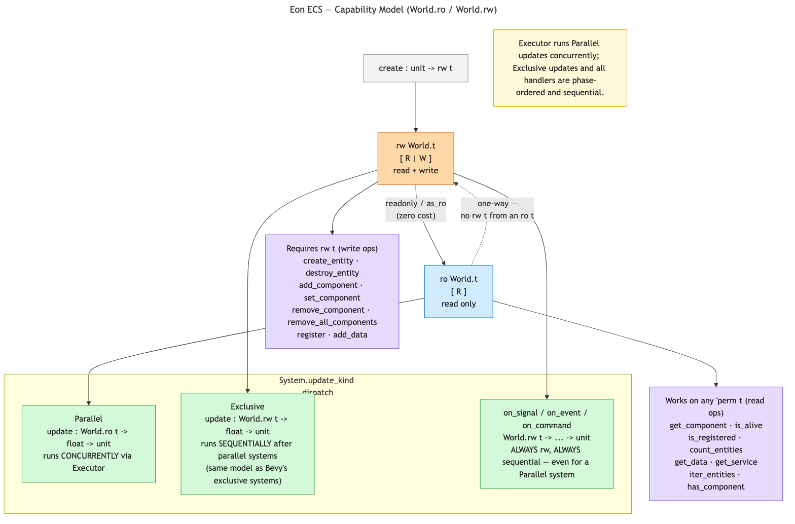

# Thread Safety & Parallel Pipeline Design

## Status

**IMPLEMENTED** (ecs-021 through ecs-026). Philosophy and invariants decided and implemented. Interacts with
[world_module_design.md](world_module_design.md) and
[query_view_design.md](query_view_design.md) (read access via the view).

The concrete implementation specification — module shapes, functor signatures,
`Executor.S` interface, and bus merge protocol — lives in
[parallel_pipeline_execution.md](parallel_pipeline_execution.md). This document
is the philosophy and invariants; that document is the how.

---

## 1. Philosophy

**eon_ecs and eon_engine are single-threaded by default and never impose a
thread-safety solution.** Concurrency correctness is the **user's**
responsibility — the user knows their game's shared-data access patterns, so
they write the correct concurrent code. The libraries' job is only to make it
*possible* to add thread-safe solutions, guaranteed through documented design
choices and extension seams — not to ship locks, atomics, or a scheduler the
user didn't ask for.

This is the concurrency expression of the lean-essential-core stance: the core
stays simple and opinionated; anything heavier is opt-in. (Contrast Bevy / Unity
DOTS, which auto-parallelize and impose a scheduler.)

When concurrency comes up, the answer is a **seam** — a phase tag, a functor
parameter, a typed world view, a documented invariant — never an imposed
solution baked into the core.

---

## 2. Layering: opinionated sequential core, opt-in parallel engine

- **`eon_ecs` is strictly sequential and opinionated.** Pipelines and systems run
  sequentially, full stop. No parallelism, no locks, no atomics-for-safety in the
  core. This opinion is a *feature*: it gives the engine well-defined barriers to
  build on. If the core left phase ordering loose, the engine could not promise
  the barriers the parallel model depends on.
- **`eon_engine` ships its own pipeline** with sequential *phases* but optionally
  *parallel systems within a phase*, enforced by `World.ro`/`World.rw` phantom
  capability types. This is opt-in and layered on top of the sequential core.

```
game code
    ↓
Engine parallel pipeline   ← World.ro/rw phantom types, parallel systems (eon_engine)
    ↓
Sequential primitives      ← Pipeline/System, strictly sequential (eon_ecs, unchanged)
```

---

## 3. The sequential-phase invariant (the backbone)

**Phases are always sequential.** This is load-bearing: each phase boundary is a
guaranteed sync point. Everything below — the bus merge, the dirty-flag settling
— anchors to phase boundaries. The *only* concurrency is *within* a phase,
among its systems' `update` calls.

```
Phases: strictly sequential  → they ARE the barriers
System updates within a phase: parallel → the only concurrency
```

---

## 4. No phase tags — `World.ro`/`World.rw` does the job

Earlier designs proposed `Read_only` / `Read_write` phase tags to distinguish
parallel-safe from parallel-unsafe phases. **These are dropped.**

The parallel pipeline only accepts **reactive systems**, whose `update` always
takes `World.ro World.t`. Since all updates are read-only by the type
system, every phase's updates are safe to run in parallel — no per-phase tag
is needed to make that determination. The phantom type enforces the invariant at
compile time; a phase tag would only document a promise the compiler already
checks.

```
update    : World.ro World.t → float → unit   (* all phases, parallel *)
on_signal : World.rw World.t → 's → unit      (* always sequential *)
on_event  : World.rw World.t → 'e → unit      (* always sequential *)
on_command: World.rw World.t → 'c → unit      (* always sequential *)
```

Phases still exist for **ordering** — controlling which groups of systems run
before others. That job is independent of parallel/sequential dispatch.

---

## 5. Frame order and where parallelism sits

From [loop.mli](../../eon_ecs/loop.mli), each `eon_ecs` frame is:

```
collect   →   Progress.tick   →   drain
```

(No rendering step here — `eon_ecs.Loop` is pure collect/tick/drain, no
platform seam. `eon_engine.Loop` adds `Platform.Input_backend.collect`
before this and `Platform.Audio_backend.submit` /
`Platform.Rendering_backend.render` after it; see
[rendering_layer_design.md §8](rendering_layer_design.md).)

- **`Progress.tick`** runs system `update` functions → all parallel, all `ro`.
- **`collect`** (frame start) and **`drain`** (frame end) are where
  `on_*` handlers fire → always sequential, always `rw`. Both sit *outside* `tick`.

The frame order enforces the split structurally: reads and writes never
interleave within a frame, and the parallel `tick` window has no active writer.



([editable source](diagrams/frame_order_bus_timing.excalidraw))

`collect`/`drain` each dispatch three buses, in a *different* order on each
side — `Signals → Events → Commands` on `collect`, `Signals → Commands →
Events` on `drain` — but the important distinction isn't the ordering, it's
*when a bus's `emit` becomes visible*, per {!Eon_ecs.Bus.S}:

- **`Signals` and `Commands`** are `Single_bus` — `drain = collect`
  ([single_bus.mli](../../eon_ecs/single_bus.mli)): whatever was `emit`ted
  during the current frame is delivered by the end of that same frame.
- **`Events`** is `Double_bus` — `emit` writes to a `next` queue
  ([double_bus.mli](../../eon_ecs/double_bus.mli)): `drain` delivers whatever
  is in `current`, then swaps `next` into `current`. An event emitted during
  frame `N` is not delivered until frame `N+1`'s `drain`.

```ocaml
(* eon_ecs/bus.mli — the shared shape both Single_bus and Double_bus satisfy *)
val emit    : 'msg t -> 'msg -> unit
val collect : 'msg t -> unit
val drain   : 'msg t -> unit

(* A signal emitted this frame fires by the end of this frame: *)
Signals.emit bus (`Damage_taken (entity, 5));
(* ... same frame ... *)
Signals.drain bus   (* handler runs now *)

(* An event emitted this frame doesn't fire until next frame's drain: *)
Events.emit bus (`Level_up entity);
Events.drain bus   (* handler does NOT run yet — delivered next frame *)
```

This is exactly the mechanism `Eon_engine.Bus`/`Single_bus`/`Double_bus`
(§8 below) wrap with a mutex for parallel-safe `emit` — the collect/drain
timing semantics are unchanged, only `emit` gains a lock.

### 5.1 What `Progress.tick` actually dispatches

`collect`/`drain` are one step each; `Progress.tick` is where the real
branching happens — it's driven by a `mode` (`eon_ecs/progress.mli`,
`Progress.Make_with_kind`):

```ocaml
type mode =
  | Variable
  | Fixed of float
  | Hybrid of float
```



([editable source](diagrams/loop_flow.excalidraw))

- **`Variable`** — `run(kind:`variable, dt:frame_dt)` exactly **once** per
  frame, with the real frame delta.
- **`Fixed step`** — an accumulator: `while acc >= step: run(kind:`fixed,
  dt:step); acc -= step`. Runs **0 to N times** per frame depending on how
  much time has accumulated — the classic fixed-timestep catch-up loop.
- **`Hybrid step`** — both: the `Fixed`-style accumulator loop for
  `` `fixed``-tagged systems, plus one additional `` `variable`` run per
  frame for systems that want to see every frame regardless of the fixed
  step.

Every `run(kind, dt)` call bottoms out in the same place —
`Pipeline.run_by_filter` (`eon_ecs/pipeline.mli`):

```ocaml
(* for phase in topological order: *)
(*   for system in phase where System.kind_of sys matches the filter: *)
(*     System.run sys world dt   -- invokes the system's `update` callback *)
```

This is the piece worth being precise about: **`update` is only ever called
from inside `Progress.tick`.** `on_signal`/`on_event`/`on_command` are never
invoked from `run_by_filter` at all — they're bus subscribers, wired once by
`register_all` (§11.1) and fired by `Buses.drain`/`collect`, entirely
outside the `tick` window. Choosing `Variable`/`Fixed`/`Hybrid` changes
*how many times, and with what `dt`*, `update` gets called — it has no
effect on handler timing.

---

## 6. Query iteration under parallelism

The current backend is sparse-set based (`iter1`/`iter2`/`iter3`/`iter4` in
`Eon_ecs.Query`). There is **no index to rebuild** — queries walk sparse sets
directly, with `iter2`–`iter4` picking the smallest set as the iteration base
and checking membership in the others. This is inherently stateless on the read
path.

The parallelism concern is therefore **structural mutation**, not index
reconstruction. `add_component`, `remove_component`, and `destroy_entity` all
mutate sparse sets — inserting or removing entries in the dense array and index
table. If a `Read_only` phase runs such mutations concurrently with queries, the
iterating worker races with the mutating one even though the system is tagged
read-only.

**Resolution — confine structural mutations to the write side of the frame
boundary.** A structurally safe `Read_only` phase requires that no `add_`,
`remove_`, or `destroy_` calls are in flight during `Progress.tick`. Given the
frame order:

```
collect  →  Progress.tick  →  drain
```

structural mutations come from `on_*` handlers, which fire during `collect` and
`drain` — both outside `tick`. As long as the §5 discipline holds (update only
reads; on_* handlers only write), the parallel read phase sees a structurally
frozen world with no active writers.

No boundary sync step is needed beyond what the frame order already provides.
Layering: the engine's parallel loop enforces the phase boundary; `eon_ecs` core
needs nothing.

---

## 7. Enforcement: typed `RO` / `RW` world views

**Decided: ship with the first parallel pipeline.**

The §4 invariant is promoted from a documented promise to a **compile-time
guarantee** using **phantom capability types** — OCaml's idiom for read/write
capabilities, essentially a hand-rolled `&World` vs `&mut World`.

### Optional — parallel pipeline only

`World_cap` is only used when the parallel pipeline is used. The two stacks
are fully independent:

| Stack | World type | When to use |
|---|---|---|
| Sequential | `World.rw World.t` | `Eon_ecs.Pipeline` or sequential `Eon_engine.Pipeline` |
| Parallel | `World.ro World.t` / `World.rw World.t` | `Eon_engine.Pipeline` (parallel) |

A game that never uses parallel systems only ever sees `World.rw World.t`.
The pipeline internally calls `World.readonly` once per `run` call.

### Shape — implemented in `World` directly (ecs-023)

`ro` and `rw` are type aliases for polymorphic variants, defined directly on
`World`:

```ocaml
(* eon_engine/world.mli *)
type ro = [ `R ]
type rw = [ `R | `W ]
type 'perm t       (* phantom — 'perm has no runtime representation *)

val create   : unit -> rw t
val readonly : rw t -> ro t   (* zero-cost: external "%identity" *)

(* read operations — accept any 'perm *)
val get_component    : 'perm t -> entity_id -> 'a Component_descriptor.t -> 'a option
val is_alive         : 'perm t -> entity_id -> bool
(* ... all read ops ... *)

(* write operations — rw only *)
val create_entity    : rw t -> entity_id
val add_component    : rw t -> entity_id -> 'a Component_descriptor.t -> 'a -> unit
(* ... all write ops ... *)
```

- `update : World.ro World.t -> float -> unit` — parallel systems only read.
- `on_command : World.rw World.t -> ... -> unit` — handlers may write.

`World_cap` was a separate wrapper module (ecs-021). It was removed in ecs-023:
the phantom types now live directly on `World`, eliminating one layer of
indirection and removing `World_cap` from all developer-facing signatures.



([editable source](diagrams/capability_model.excalidraw))

`readonly`/`as_ro` are **one-way** — there is no `rw t` accessible from an
`ro t`, by construction (no function in `world.mli` produces one). A system
declares its capability need through `System.update_kind`
(`eon_engine/system.mli`):

```ocaml
type update_kind =
  | Parallel  of (World.ro World.t -> float -> unit)
  | Exclusive of (World.rw World.t -> float -> unit)
```

- **`Parallel`** — `update` gets `World.ro World.t`; the pipeline's
  `Executor` may run it concurrently with other `Parallel` systems in the
  same phase.
- **`Exclusive`** — `update` gets `World.rw World.t`; runs sequentially
  after every `Parallel` system in the phase has completed (same model as
  Bevy's exclusive systems). See
  [parallel_pipeline_execution.md §5.4](parallel_pipeline_execution.md) for
  worked `System.make` examples of both.

The subtlety the diagram calls out: **`on_signal`/`on_event`/`on_command`
always take `World.rw World.t` and always run sequentially — regardless of
whether the system itself is `Parallel` or `Exclusive`.** A `Parallel`
system's `update` is read-only and safe to run concurrently, but its
handlers are not part of that concurrent window at all; they fire during
`collect`/`drain` (§5), strictly outside `tick`.

### Limits (what "enforced" means)

1. **Guards the world API, not mutation reachable through it.** If `update`
   fetches a service/resource whose value is mutable (`ref`, `Hashtbl`,
   `Atomic`), it can mutate *through* it; the phantom cannot see that. `RO`
   proves "no component/entity mutation via the world API," not "no side
   effects." Rust has the same escape hatch (`Res<Mutex<T>>` interior
   mutability) — enforced for the direct path, user's responsibility beyond it.
2. **Closures can launder capabilities** — a handler could capture an `rw`
   world and stash it where an `update` later reaches it. Rare, but untracked
   by the phantom.

### `WO` (write-only) handlers?

Expressible, but usually impractical — handlers typically read current state to
decide what to write. `RW` for handlers is the pragmatic default; reserve `WO`
for the rare blind-write handler.

---

## 8. Buses under parallelism

**Decision: `Eon_engine` owns its own mutex-aware `Single_bus` and `Double_bus`
implementations; `eon_ecs` buses are left completely untouched.**

Signals / Events / Commands are emitted-to during systems. If parallel systems
`emit` to one shared bus concurrently, that races. The fix is a **`Mutex` on
`emit`** only — self-contained in the bus, no changes to Executor, Pipeline,
World, or system interface.

`eon_engine` defines `Bus.S` (= `Eon_ecs.Bus.S`) and provides standalone
implementations:

- **`Eon_engine.Single_bus`**: flat record with `Queue.t`, `Mutex.t`, and
  handlers. `emit` locks; `drain`/`collect`/`on` run sequentially and need no
  locking.
- **`Eon_engine.Double_bus`**: same structure with `current`/`next` queue pair;
  `emit` pushes to `next` under the mutex; `drain` runs `collect` on `current`
  then swaps — both sequentially.

Per-worker local buffers (the alternative) were rejected: they cannot be
contained in the Executor without touching World, bus, or system interface.

See [parallel_pipeline_execution.md §8](parallel_pipeline_execution.md) for the
full module shapes and rationale.

---

## 9. Invariants Summary

The parallel `tick` is safe **iff** all of these hold:

1. **Phases run sequentially** (§3) — the barriers exist.
2. **All system `update` functions are read-only** (§4) — enforced at compile
   time by `World.ro World.t` (§7).
3. **No structural mutations (`add_component`, `remove_component`,
   `destroy_entity`) are in flight during `tick`** — they are confined to
   `on_*` handlers in `collect`/`drain`, outside the parallel window (§6).
4. **Bus `emit` is `Mutex`-protected; dispatch stays sequential** (§8).

Invariants (1), (3), and (4) are structural guarantees from the pipeline and
frame order. Invariant (2) is a compile-time guarantee enforced by `World.ro World.t`.

---

## 10. What NOT to Do

- **Do not add locks/atomics/thread-safe structures to `eon_ecs` core "for
  safety."** Concurrency is a seam, not an imposed core feature.
- **Do not run subscriber/handler callbacks concurrently.** Only system
  `update` runs in parallel; everything that can mutate stays sequential at a
  barrier.
- **Do not call `add_component`, `remove_component`, or `destroy_entity` inside
  `update`.** Structural mutations must stay in `on_*` handlers that fire during
  `collect`/`drain`, never during the parallel `tick`. `World.ro World.t` enforces
  this at the type level.
- **Do not phantom-type `Eon_ecs.World.t`.** The phantom capability types live
  in `Eon_engine.World` only; `eon_ecs` stays unparametrized.

---

## 11. Pipeline Implementation (decided)

The engine ships its own **`Eon_engine.Pipeline.Make(System)(Executor)(Buses)`**
functor — a genuinely new pipeline with parallel dispatch, **not** a wrapper
over the core pipeline. `Buses` bundles `signals`/`events`/`commands`/
`unsubscribe_all` (pass `Eon_engine.Buses.Default` unless wiring a custom
transport) — see §11.1 for the parallel to `Eon_ecs.Pipeline.Make`'s own
`Buses` argument. It reuses `Eon_ecs.Dependency_graph` for phase ordering
and dispatches system `update_ro` closures via `Executor.run_all`.

The engine's `System.make` **wraps** `Eon_ecs.System.make` (following
the same pattern as `Eon_engine.World` wrapping `Eon_ecs.World`). The returned
system embeds a core `Eon_ecs.System.Default.t` — fully compatible with
`Eon_ecs.Pipeline.Make` for sequential execution.

`eon_ecs` is untouched except for `Dependency_graph`. No changes to
`Eon_ecs.System.S`, `Eon_ecs.Pipeline.S`, `Eon_ecs.Progress`, or `Eon_ecs.Loop`.

- **The dependency graph is extracted into the core as a public primitive.**
  `Eon_ecs.Dependency_graph` (a generic DAG: `add_node`, `before`/`after` edge,
  `topo_sort` with caching, cycle detection) is re-exported from `eon_ecs.mli`.
  `Eon_ecs.Pipeline.Make` is refactored to delegate to it (behaviour-preserving).
  `Eon_engine.Pipeline.Make(System)(Executor)(Buses)` reuses the same
  primitive rather than re-implementing the graph. See [parallel_pipeline_execution.md §2](parallel_pipeline_execution.md).

- **No phase tags.** All phases dispatch via `Executor` — `Sequential` gives
  the sequential fallback, `Domain_pool` gives parallelism. Phase tags were
  dropped: since all system `update` functions must take `World.ro World.t`,
  every phase is always safe to run in parallel. A per-phase tag would only
  re-state what the type system already guarantees. See §4.

- **Execution:** `Executor.run_all` receives jobs for each phase's systems and
  blocks until all complete. Phase boundary = sync point. `run_by_filter` filters
  by system `kind` (`Fixed`/`Variable`) before dispatching. See
  [parallel_pipeline_execution.md §7](parallel_pipeline_execution.md).

### 11.1 `Eon_ecs.Pipeline.Make` — the sequential core functor's actual shape

Distinct from `Eon_engine.Pipeline.Make(System)(Executor)(Buses)` above.
`Eon_ecs.Pipeline.Make` (`pipeline.mli`) takes two arguments — `System` and a
single `Buses` module that *bundles* the signals/events/commands accessors,
not three separate functor parameters:

```ocaml
module Make
    (System : System.S)
    (Buses : sig
       val signals         : unit -> 'a System.Signal_bus.t
       val events          : unit -> 'a System.Event_bus.t
       val commands        : unit -> 'a System.Command_bus.t
       val unsubscribe_all : unit -> unit
     end)
  : S with type world = World.t
```

`System.attach` (called by `register_all`, once per system, in topological
phase order) takes the three buses as explicit labeled arguments:

```ocaml
val attach :
  ('s, 'e, 'c) t -> World.t ->
  signals:'s Signal_bus.t ->
  events:'e Event_bus.t ->
  commands:'c Command_bus.t -> unit
```

**Lifecycle contract** — `register_all`/`reset`:

- `register_all : 'phase t -> world -> unit` runs every system's `register`
  callback, then `attach`, in phase order. Calling it a second time without
  an intervening `reset` raises `Invalid_argument`.
- `reset : 'phase t -> unit` calls `Buses.unsubscribe_all ()` and clears the
  "already registered" flag, so `register_all` can run again. This is the
  mechanism for scene transitions: `reset` when tearing down a scene, rebuild
  the pipeline, `register_all` for the next one.

## 12. Open Decisions

1. **Ship `RO`/`RW` world views?** Decided: yes, with the first parallel
   pipeline. Option A (`ro`/`rw` aliases + explicit `readonly` downgrade) — see
   §7 for the full design.
2. **Concrete executor(s).** The `Executor` functor parameter (§11) is the
   threading-substrate seam: ship `Sequential` (default, core-equivalent) plus at
   least one parallel executor. Which first — Domains (OCaml 5), a thread pool? —
   and is a user-supplied executor a documented extension point from day one?
3. **Parallel-bus spec.** The per-worker buffer approach was rejected (cannot
   be contained in the Executor without touching World, bus, or system
   interface). The agreed fix is a `Mutex` on `emit` only. **Decided:**
   `eon_engine` owns its own `Single_bus` / `Double_bus` implementations with
   a mutex on `emit`; `eon_ecs` buses are left completely untouched. See
   [parallel_pipeline_execution.md §8](parallel_pipeline_execution.md).
