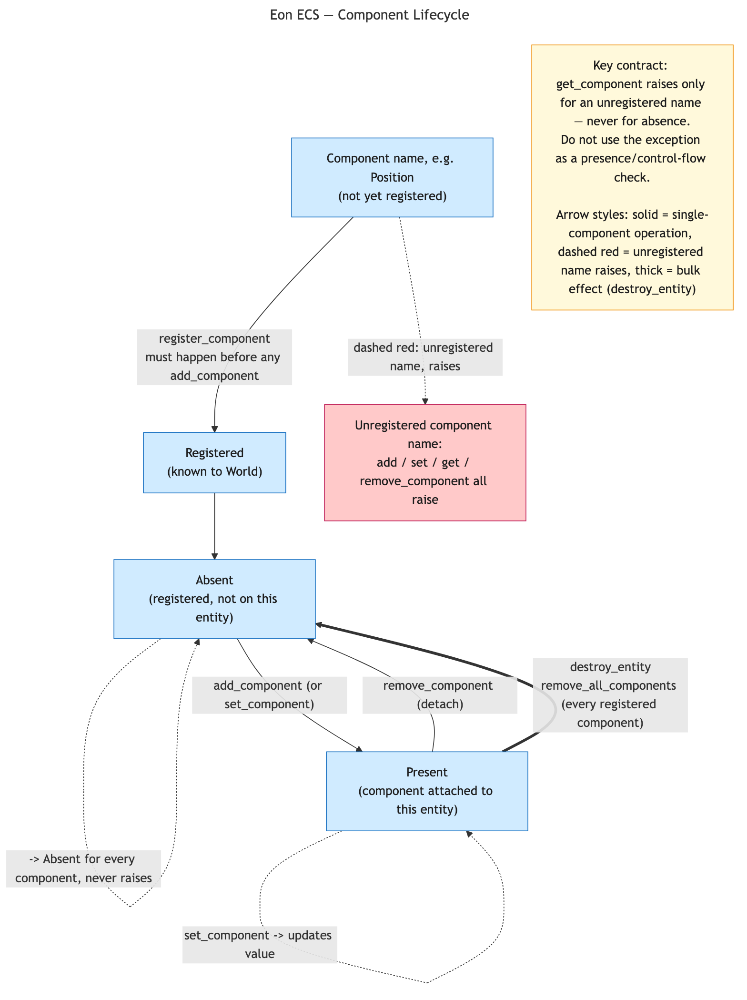

# Eon Engine — World Module Design

## Status

**IMPLEMENTED** (ecs-016/017/019, capability model added ecs-023/025/026).
Earlier revisions of this document described an archetype cache (Bitset,
Archetype_index, Archetype_backend) and a `World.Make` functor parameterised
over a `TRACKING` signature. Both were dropped as premature optimisations.
This document covers what was implemented: the `World.S` signature, the
`ro`/`rw` phantom-type capability model that later replaced the standalone
`World_cap` module (ecs-023 "getting rid of it"), the per-world `Id_counter`,
and the `Sparse_set_backend.Make(W : World.S)` functor.

The `Archetype_backend` sections of `eon_engine_query_design.md` are superseded
by this document. The rest of that document (query builder, `Sparse_set_backend`,
`Fallback` functor) remains authoritative.

---

## What This Document Covers

Three tightly-related pieces of `eon_engine` infrastructure:

- **`World.S`** — the uniform signature that all engine code depends on.
  Backends, query builders, and game code program to this signature rather than
  to `Eon_ecs.World` directly. It wraps registration, mutation, and the component
  plane, providing a single coherent API.
- **Per-world `Id_counter`** — replaces any global `Atomic` counter in
  `Component_descriptor`. Each world allocates dense ids `0, 1, 2, …`
  independently; ids have no meaning across worlds.
- **`Sparse_set_backend.Make(W : World.S)`** — turns the backend into a functor
  so the world type is swappable without rewriting the backend. `Default =
  Make(World)` is the concrete instance everyone uses.

Everything else — a `TRACKING` signature, a `World.Make` functor, `No_tracking`,
`Dirty_flag` — is deferred. If benchmarks eventually justify a query-acceleration
cache or a debug-tooling hook, those can be added as a functor layer on top of
the concrete `World` module without changing any existing code.

---

## 1. `World.S` — Uniform World Signature, and the `ro`/`rw` Capability Model

File: `eon_engine/world.mli`

`World` is capability-tagged: the handle is `'perm t`, where `'perm` is a
**phantom type** — it never appears in the record's actual fields, it only
constrains which operations the type-checker will accept:

```ocaml
type ro = [ `R ]
type rw = [ `R | `W ]

type 'perm t
```

`create` hands out full read-write access; `readonly`/`as_ro` are one-way,
zero-cost downgrades (no `rw t` can be recovered from an `ro t`):

```ocaml
val create   : unit -> rw t
val readonly : rw t -> ro t
val as_ro    : 'perm t -> ro t
```

`World.S` is the **read-only** backend signature — the one query backends and
`Sparse_set_backend.Make` depend on, since any `'perm t` (`ro` or `rw`) is
accepted:

```ocaml
module type S = sig
  type 'perm t

  val get_component  : 'perm t -> entity_id -> 'a Component_descriptor.t -> 'a option
  val is_alive       : 'perm t -> entity_id -> bool
  val is_registered  : 'perm t -> 'a Component_descriptor.t -> bool
  val count_entities : 'perm t -> int
  val get_data       : 'perm t -> [> ] -> 'a option
  val count_data     : 'perm t -> int
  val get_service    : 'perm t -> [> ] -> 'a option
  val list_services  : 'perm t -> int list

  val iter_entities : 'perm t -> string list -> (entity_id -> unit) -> unit
  (** Iterate every alive entity that has all of the named components, using the
      smallest sparse set as the iteration base. Raises [Invalid_argument] if any
      name was never registered. *)

  val has_component : 'perm t -> entity_id -> string -> bool
  (** Return [true] if the entity currently holds the named component.
      Returns [false] if the component is not registered or is absent on the entity. *)
end
```

The same read operations are also exposed as top-level `World.get_component`,
`World.is_alive`, etc. — `'perm t -> ...`, so they work on either capability
level. **Write operations require `rw t` specifically** — they're not part of
the read-only `S` signature at all:

```ocaml
val create_entity        : rw t -> entity_id
val destroy_entity       : rw t -> entity_id -> unit
val add_component        : rw t -> entity_id -> 'a Component_descriptor.t -> 'a -> unit
val set_component        : rw t -> entity_id -> 'a Component_descriptor.t -> 'a -> unit
val remove_component     : rw t -> entity_id -> 'a Component_descriptor.t -> unit
val remove_all_components: rw t -> entity_id -> unit
val register              : rw t -> 'a Component_descriptor.t -> Component_descriptor.registration_result

val add_data    : rw t -> [> ] -> 'a -> unit
val set_data    : rw t -> [> ] -> 'a -> unit
val add_service : rw t -> [> ] -> 'a -> unit
```

`World.S` has no reference to `Eon_ecs.World.t`. Backends depend only on this
signature; they work with `W.t` throughout and call `W.iter_entities` /
`W.has_component` for query operations. This is also exactly the mechanism
`Eon_engine.System`'s `Parallel`/`Exclusive` dispatch relies on: a `Parallel`
system's `update` receives `World.ro World.t` and can run concurrently
(read-only, no aliasing hazard); an `Exclusive` system's `update`, and every
`on_signal`/`on_event`/`on_command` handler regardless of kind, receives
`World.rw World.t` and runs sequentially. See `thread_safety_design.md` for
the full parallel-dispatch rationale.

### 1.1 Component lifecycle

Two tiers: a one-time **world-level registration** step, then a repeatable
**per-entity presence** cycle. Both are enforced by `Eon_ecs.World`
(`eon_ecs/world.mli`), which `Eon_engine.World` wraps directly.



([editable source](diagrams/component_lifecycle.mmd))

```ocaml
(* World-level, once, before any add_component for this name: *)
val register_component : t -> name:string -> id:int -> 'a Component.component

(* Per-entity, any number of times after registration: *)
val add_component    : t -> Entity_id.t -> name:string -> 'a -> unit
(** Raises if the component name is not registered. *)

val set_component    : t -> Entity_id.t -> name:string -> 'a -> unit
(** Raises if the component name is not registered. Promotes to an add if the
    entity doesn't currently hold the component. *)

val get_component    : t -> Entity_id.t -> name:string -> 'a option
(** [None] if the entity doesn't have the component. Raises if the component
    name is not registered — this is a *different* condition from "absent,"
    and the exception must never be used as a presence check. *)

val remove_component  : t -> Entity_id.t -> name:string -> unit
(** Raises if the component name is not registered. *)

val remove_all_components : t -> Entity_id.t -> unit
(** No raise regardless of what the entity currently holds — called by
    [destroy_entity], safe without any manual cleanup. *)
```

The recurring contract across `add`/`set`/`get`/`remove_component`: **raises
on an unregistered name, never on absence.** A registered-but-absent
component is a normal, expected state (`get_component` returns `None`); an
unregistered name is a programmer error (missing `register_component` call).
Confusing the two — e.g. wrapping `get_component` in a `try ... with _ ->
None` to sidestep both cases uniformly — hides the second, real bug.

---

## 2. Concrete `World` Module

File: `eon_engine/world.ml`

```ocaml
type ro = [ `R ]
type rw = [ `R | `W ]

type 'perm t = {
  core            : Eon_ecs.World.t;
  mutable next_id : int [@atomic];   (* per-world dense component id allocator *)
}

let create () =
  { core = Eon_ecs.World.create (); next_id = 0 }

(* Zero-cost capability downgrade: 'perm never appears in the record fields,
   so this is a pure type-level cast, not a runtime conversion. *)
external readonly : rw t -> ro t = "%identity"
external as_ro     : 'perm t -> ro t = "%identity"

let register world comp =
  let name = Component_descriptor.name comp in
  if Component_descriptor.is_registered world.core comp then
    Component_descriptor.Already_registered
  else begin
    let id = Atomic.Loc.fetch_and_add [%atomic.loc world.next_id] 1 in
    Eon_ecs.World.register_component world.core ~name ~id;
    Component_descriptor.Registered
  end

(* Structural mutations — all take rw t at the .mli boundary *)
let add_component world entity comp value =
  Eon_ecs.World.add_component world.core entity
    ~name:(Component_descriptor.name comp) value

let remove_component world entity comp =
  Eon_ecs.World.remove_component world.core entity
    ~name:(Component_descriptor.name comp)

let remove_all_components world entity =
  Eon_ecs.World.remove_all_components world.core entity

let destroy_entity world entity =
  Eon_ecs.World.destroy_entity world.core entity

(* Value mutation — does NOT change component signature *)
let set_component world entity comp value =
  Eon_ecs.World.set_component world.core entity
    ~name:(Component_descriptor.name comp) value

(* Backend query primitives — take 'perm t, work on either capability *)
let iter_entities world names f =
  Eon_ecs.World.iter_entities world.core names f

let has_component world entity name =
  match Eon_ecs.World.find_component world.core ~name with
  | None   -> false
  | Some _ -> Option.is_some (Eon_ecs.World.get_component world.core entity ~name)

(* ... remaining delegations (get_component, create_entity, etc.) ... *)
```

The capability split is enforced entirely by the `.mli` — at the `.ml` level
every function still just takes the same underlying `'perm t` record; nothing
at runtime distinguishes an `ro t` from an `rw t`. `readonly`/`as_ro` compile
to `%identity`, i.e. genuinely zero cost, not merely "cheap."

`next_id` uses the OCaml 5.4 atomic record field syntax — the `[@atomic]`
attribute goes **after the type**: `mutable next_id : int [@atomic]`. This
stores the integer inline in the record rather than as a separate heap object.
Compared to `int Atomic.t`, this eliminates one indirection and one allocation
per world. `[%atomic.loc world.next_id]` is a built-in compiler extension (no
ppx library needed) that produces an `Atomic.Loc.t` pointing at the field;
`Atomic.Loc.fetch_and_add` then operates on it atomically. Registration is
initialisation-time only, never on the hot path, so the atomic cost is
negligible in practice regardless — but the unboxed form is the right default on
5.4+.
IDs are dense per world (`0, 1, 2, …`) and have no meaning across worlds.

`Component_descriptor` is a pure name wrapper: `component` (constructor), `name`
(accessor), `is_registered` (checks via `find_component`), and
`registration_result` (`Registered | Already_registered`). It does not generate
ids or hold mutable state — id generation lives entirely in `World.register`.

---

## 3. `Sparse_set_backend.Make(W : World.S)`

File: `eon_engine/sparse_set_backend.ml`

```ocaml
module Make (W : World.S) : Query_backend.S with type world = W.t = struct
  type world = W.t

  let iter_entities world ~includes ~having ~excludes f =
    let required = includes @ having in
    W.iter_entities world required (fun entity ->
      if not (List.exists (W.has_component world entity) excludes) then
        f entity)

  let count world ~includes ~having ~excludes =
    let n = ref 0 in
    iter_entities world ~includes ~having ~excludes (fun _ -> incr n);
    !n
end

module Default = Make(World)
```

The backend works entirely through `W : World.S` — no reference to
`Eon_ecs.World.t` or `Eon_ecs.Query` anywhere. `iter_entities` merges
`includes` and `having` into the required intersection set (both mean "must be
present"), delegates to `W.iter_entities` for smallest-set-first entity
iteration, then applies the excludes list as a per-entity post-filter using
`W.has_component`. `count` reuses `iter_entities` rather than duplicating
intersection logic.

The functor lets the world type change — e.g. if a `World.Make(T : TRACKING)`
functor is added later — without touching the backend at all. Existing code that
uses `Sparse_set_backend.Default` stays unaffected; code that needs a different
world applies `Make` once at the module level.

`Default` is the only instance shipped by the engine. Users who introduce a
custom world type apply `Make` themselves:

```ocaml
module My_world = Eon_engine.World.Make(My_tracking)   (* hypothetical future *)
module My_backend = Eon_engine.Sparse_set_backend.Make(My_world)
module Query = Eon_engine.Query.Make(My_backend)
```

---

## 4. Module Stack

```
World                            ← concrete, no functor
  satisfies World.S

Sparse_set_backend.Make(W : World.S)   ← backends depend on World.S
  Sparse_set_backend.Default = Sparse_set_backend.Make(World)

Query.Make(B : Query_backend.S)        ← unchanged from query design doc
  Query.Default = Query.Make(Sparse_set_backend.Default)
```

If a `TRACKING` seam is ever needed, a `World.Make(T : TRACKING)` functor can
be layered on top of the concrete `World` module. All backends already depend on
`World.S`, so the upgrade requires no changes in `Sparse_set_backend` or `Query`.

---

## 5. Mutation Signals *(out of scope)*

Independently of any dirty flag, `eon_engine.World` mutation wrappers will emit
signals on structural changes as a general extensibility hook. This is deferred
and is a separate concern from the `Id_counter`.

---

## 6. User Wiring

Default setup — nothing to configure:

```ocaml
let world = Eon_engine.World.create ()
(* Use Eon_engine.Query.Default for queries. *)
```

---

## 7. What NOT to Do

- **Do not reintroduce a global `Atomic` counter in `Component_descriptor`** —
  per-world dense ids are the design; a global counter creates cross-world id
  collisions and global mutable state.
- **Do not bypass `World.register` by calling
  `Eon_ecs.World.register_component` directly** — the per-world id counter only
  advances inside the `register` wrapper; bypassing it produces duplicate ids.
- **Do not assume component ids are globally unique** — they are dense per world;
  `"Position"` is id `0` in every world that registers it first.
- **Do not add `to_raw` back to `World.S` or any world module** — `World.S` is
  intentionally free of any reference to `Eon_ecs.World.t`. Backends access
  everything they need through `W.iter_entities` and `W.has_component`. If a
  backend seems to need raw access, the right fix is to add the missing primitive
  to `World.S`, not to punch a hole through the abstraction.
- **Do not add external opam dependencies** unless strictly necessary and not
  achievable with stdlib alone.
